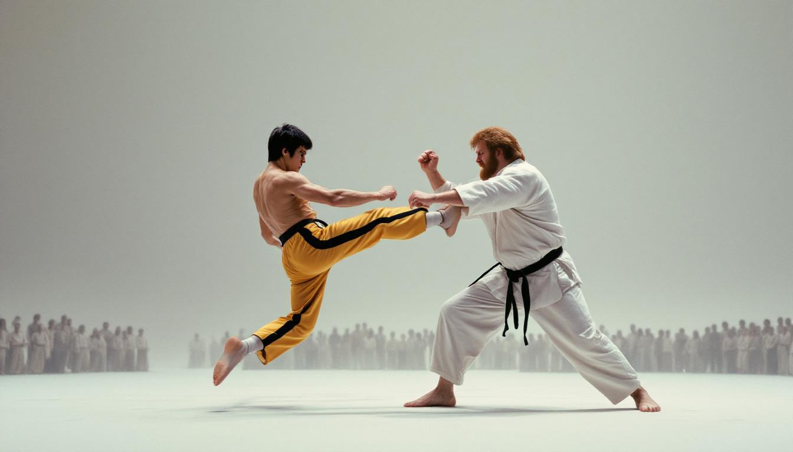

THE INTERMEDIATE STATE — Bruce Lee and Chuck Norris have been engaged in continuous hand-to-hand combat in purgatory since at least early 2024, according to multiple celestial sources familiar with the situation, raising difficult questions for theologians and martial arts historians alike.

The fight, which appears to have no referee, no point system, and no clear path to resolution, has reportedly drawn a sizable crowd of souls awaiting final judgment who have largely abandoned quiet contemplation in favor of watching two of history's most celebrated martial artists trade blows across an undifferentiated gray expanse.

"It started as what appeared to be a respectful sparring session," said Father Dominic Correra, a Jesuit eschatologist at Georgetown University who claims to have received detailed accounts through prayer intercession channels. "But it escalated. Neither party seems willing to concede, and the usual mechanisms for resolving purgatorial disputes — contrition, divine grace, the passage of subjective time — do not appear to apply to a roundhouse kick."

Norris, who arrived in the intermediate state in 2017 according to no verifiable source but whom multiple theologians insisted was "spiritually present in purgatory on a technicality," has reportedly favored a defensive strategy built around his trademark spinning back kicks and an apparently inexhaustible supply of patience. Lee, who has been dead since 1973 and whose purgatorial status has long been a matter of ecumenical debate, is said to be employing a fluid Jeet Kune Do approach that has drawn admiration from onlookers but has yet to produce a knockout.

"People forget that Chuck Norris is a tenth-degree black belt in Chun Kuk Do, a system he invented himself," said Dr. Helen Tsao, chair of combat theology at the University of Chicago Divinity School. "You cannot simply Wing Chun your way past a man who literally wrote the rules of his own martial art. Especially not in a liminal space where the laws of physics are, at best, advisory."

Vatican officials declined to comment on the specifics of the confrontation but issued a brief statement noting that "the Church's position on purgatory does not explicitly preclude martial arts." A footnote added that the Holy See "has no official stance on who would win."
