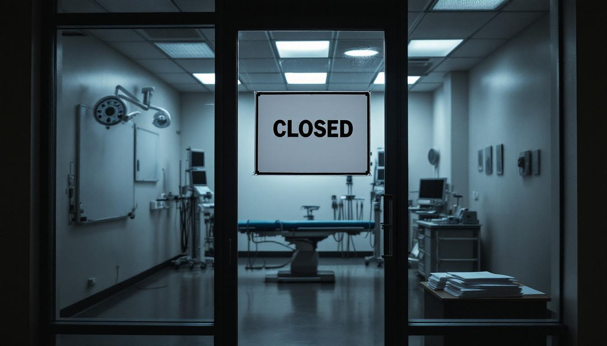

NEW YORK — The orthopedic surgery industry in New York City is facing what economists are calling an unprecedented demand-side collapse, following the death of John Reese, a former government operative whose singular preference for non-lethal, kneecap-specific gunshot wounds had, over the course of nearly a decade, sustained a significant portion of the city's surgical caseload.

At least fourteen specialty orthopedic practices have filed for bankruptcy protection in the past eighteen months, with several more expected to follow. Industry analysts point to a single variable: the disappearance from city streets of the man whom orthopedic surgeons privately referred to as "the referral." According to data compiled by the New York Orthopedic Surgical Consortium, Mr. Reese was directly or indirectly responsible for an estimated 34 percent of all knee reconstruction surgeries performed in Manhattan between 2011 and 2019 — a figure that practitioners say they did not fully appreciate until the pipeline went dry.

"He was consistent," said Dr. Annette Vasiliev, a board-certified orthopedic surgeon who operated a three-physician practice on the Upper East Side before closing it last spring. "You could set your billing cycle by him. Two, sometimes three cases a week — always the knee, always clean entry, always referred immediately to emergency services. In twenty years of practice, I have never seen that kind of volume from a single source, and I have never seen a practice model collapse so completely when that source went away." Dr. Vasiliev added that she has since retrained as a general practitioner and describes the transition as "emotionally complicated."

The economic ripple effects have extended beyond surgical suites. Physical therapists, medical device suppliers, and post-operative rehabilitation centers have all reported significant contractions. The Patella Implant Division of Meridian Surgical Technologies, which held a preferred vendor agreement with several of the affected practices, announced in January that it was discontinuing its New York metropolitan sales territory entirely. "The fundamentals changed," said Marcus Enright, the company's vice president of regional sales. "We modeled for normal criminal activity. We did not model for the retirement of one very specific individual with one very specific methodology." A spokesman for the company confirmed that Mr. Reese had never been a customer directly, but said the distinction felt increasingly academic.

City health officials have convened an emergency working group to assess whether the orthopedic shortage poses a public health concern, noting that New York remains a city with substantial ongoing demand for knee surgery unrelated to targeted non-lethal interdiction. The group's preliminary report, issued in February, recommended that the city consider subsidizing orthopedic residency positions to rebuild capacity. It did not address how to replace the underlying referral volume.
