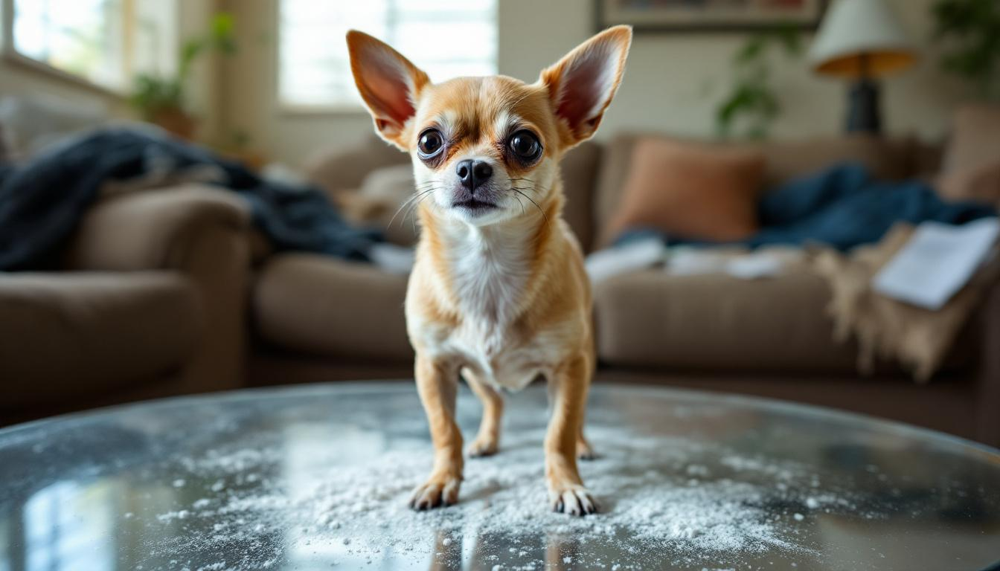

TUCSON, Ariz. — The pitch, reportedly delivered in a single breath during a seven-minute meeting at Universal Pictures, was as follows: "Same thing, but the animal is already like that."

"Cocaine Chihuahua," the sequel to the 2023 surprise hit "Cocaine Bear," arrives in theaters this weekend carrying the considerable burden of proving that Hollywood's most chemically specific franchise has legs — four of them, trembling at a frequency visible to the naked eye. The film largely succeeds, though it asks more of its audience than its predecessor, primarily because the central dramatic question — has the chihuahua ingested cocaine, or is it simply a chihuahua — is never definitively resolved.

Directed by Ramona Sepúlveda, who previously helmed the Oscar-shortlisted documentary "Eleven Days in Juárez," the film follows a seven-pound chihuahua named Senior Bitey who discovers a brick of cocaine in the wheel well of a 2004 Nissan Altima parked behind a Tucson laundromat. What follows is ninety-four minutes of sustained, close-to-the-ground chaos as Senior Bitey terrorizes a rotating cast of cartel intermediaries, animal control officers, and one deeply unfortunate postal carrier, all of whom significantly underestimate the animal based on its size.

"The challenge with a chihuahua is that the behavioral delta between sober and not sober is effectively zero," said Dr. Franklin Meade, a veterinary pharmacologist at Cornell who served as a consultant on the film. "We spent three weeks trying to establish baseline chihuahua behavior and had to abandon the effort. There is no baseline."

The film's centerpiece sequence — a twelve-minute, single-take chase through a quinceañera — is genuinely impressive filmmaking, though it required the construction of a separate, chihuahua-scale camera rig that cost more than the animal talent budget for the entire production. The scene ends with Senior Bitey running directly through a sheet cake at skull height, emerging on the other side coated in buttercream and vibrating with what cinematographer Leon Pak described in production notes as "a frequency we could not attribute to any single cause."

Critics have noted that the film struggles in its second act, when it attempts to humanize the cartel subplot, a narrative choice that pulls focus from the chihuahua. "Every second the chihuahua is off screen, the audience can feel it," said Patricia Engstrom, a film critic for The Arizona Republic. "Not because they miss the chihuahua, but because they know it's still out there somewhere, and that knowledge is doing something to the room."

Ray Liotta, to whom the first film was posthumously dedicated, receives no mention in this installment, which instead opens with the title card: "For everyone who has ever looked at a small dog and thought, 'Something is wrong with that thing.'" The dedication has drawn mild criticism from the Chihuahua Club of America, whose president, Dolores Fanning, issued a statement calling the film "an unfair characterization of a breed whose natural intensity is frequently mistaken for pathology."

Universal has already greenlit a third installment. The studio declined to confirm the animal but a source familiar with the project said the working title is "Cocaine Goldfish," adding only that "the confined environment creates interesting structural constraints."
