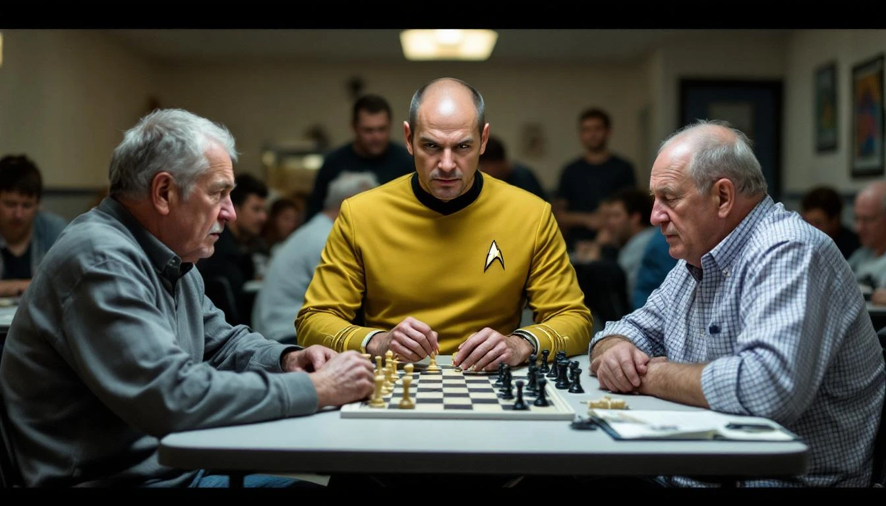

MILWAUKEE — Derek Sorvino, a 38-year-old database administrator and self-described "student of Starfleet tactical doctrine," has maintained what he calls a perfect chess record since 2022 by declaring the Kobayashi Maru — a fictional no-win scenario from the *Star Trek* franchise — each time an opponent places him in checkmate.

"The Kobayashi Maru isn't about winning or losing," Sorvino explained, carefully resetting the pieces on a board at the Milwaukee Community Chess Club, where he has been asked to leave on three separate occasions. "It's about refusing to accept the conditions of a no-win scenario. Kirk didn't accept it. I don't accept it. The fact that my king is surrounded is, frankly, beside the point."

According to Sorvino's personal scoring system, which he maintains in a laminated binder he brings to every match, a Kobayashi Maru declaration retroactively reclassifies the game as "a test of character rather than a contest of skill," rendering the outcome "strategically immaterial." He currently lists his record as 0 wins, 0 losses, and 84 Kobayashi Marus, a category he says the United States Chess Federation has so far "declined to recognize, but not explicitly prohibited."

Gerald Kwan, the club's director and a FIDE-rated player, said he has attempted to explain to Sorvino on multiple occasions that the Kobayashi Maru is a narrative device from a science fiction film and has no standing in competitive chess. "He told me I was thinking like a Romulan," Kwan said. "I don't know what that means, but he said it with a lot of conviction."

Dr. Nina Alderman, a professor of game theory at the University of Wisconsin–Madison, said Sorvino's approach, while not valid by any recognized framework, does raise interesting philosophical questions about the definition of defeat. "In a strict sense, a loss only counts if both players agree on the scoring system," Dr. Alderman said. "Of course, in every other sense, he is simply losing at chess and then saying words."

Sorvino's opponents have responded with varying degrees of exasperation. Tom Petrich, a retired actuary who has played Sorvino four times, said the experience is "like arguing with someone who flips the Monopoly board and calls it a draw." Another opponent, who asked not to be named, said Sorvino once responded to a bishop fork by standing up, tugging the bottom of an imaginary uniform tunic, and saying, "There are four lights."

Sorvino said he is currently developing a broader framework he calls "Starfleet Applied Game Ethics," which he plans to extend to Scrabble, Settlers of Catan, and his annual performance review. "My manager says I'm not meeting expectations," Sorvino said. "I say the expectations were the Kobayashi Maru all along."
