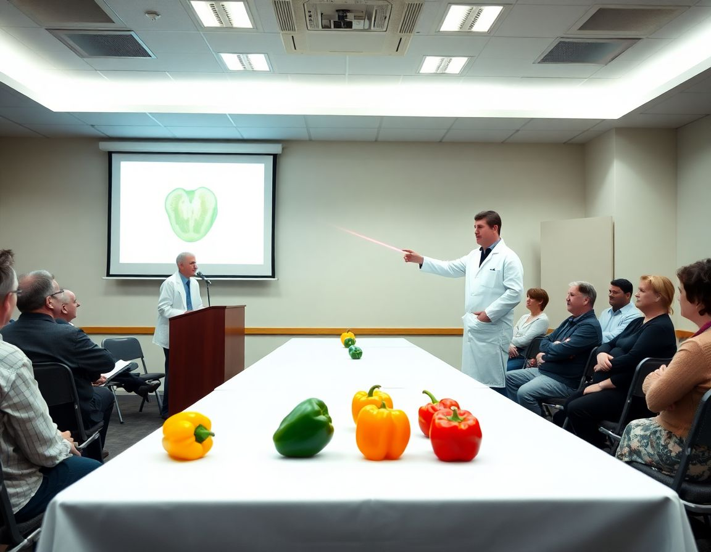

COLUMBUS, Ohio — A comprehensive national survey released Monday by the Agricultural Literacy Initiative at Ohio State University has found that approximately 68 percent of American adults believe that red, yellow, and orange bell peppers are simply green bell peppers that have been left to ripen further, a misconception that researchers described as "both understandable and entirely wrong in ways that are difficult to fully convey."

The survey, which polled 4,200 adults across all 50 states, found that the misapprehension cuts across age, education level, and regional lines, with respondents in every demographic category demonstrating a statistically significant tendency to view the bell pepper spectrum as a linear ripening continuum rather than as the product of distinct cultivars developed through decades of selective breeding. "People see green, then yellow, then orange, then red, and the brain imposes narrative," said Dr. Leanne Stroud, the study's lead author and a professor of consumer agricultural perception. "The brain wants a story. Unfortunately, the bell pepper is not telling that story."

While it is true that green bell peppers are generally harvested before full maturity — and that a green pepper left on the vine will, in many varieties, eventually redden — yellow and orange bell peppers are overwhelmingly the product of separate cultivars entirely, a distinction that has apparently failed to penetrate the public consciousness despite decades of availability. Dr. Stroud noted that the misunderstanding has measurable downstream effects, including consumers purchasing green peppers under the mistaken belief that they are practicing fiscal thrift by buying the pepper at an earlier stage, rather than at a discount because they are, according to sensory panels, less sweet and more aggressively bitter. "They think they are getting the same pepper for less money," she said. "In a narrow sense, sometimes they are. In a broader sense, they are not."

Representatives from the American Grocery Manufacturers Association did not dispute the survey's findings but noted in a statement that produce labeling falls under the jurisdiction of individual retailers and that the organization remained "committed to an informed and empowered consumer base." Glen Rafferty, a 54-year-old facilities manager from Akron who participated in the study, said he had believed the ripening theory for his entire adult life and felt, upon being corrected, a sensation he described as "not unlike being told that the months are not arranged by temperature."
