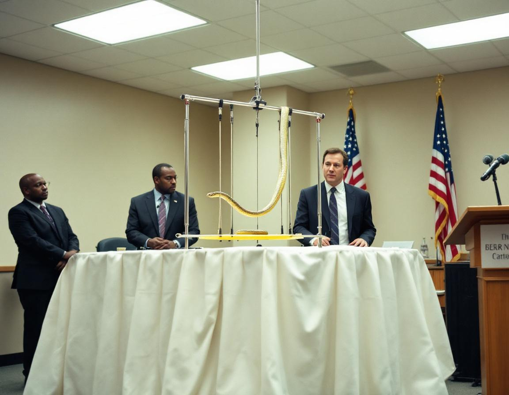

SCOTTSDALE, Ariz. — Apex Novelty Solutions, the manufacturer behind a line of miniature circus apparatus for domestic reptiles, announced Monday that it is seeking a new name for its flagship product, the Herpeze Snake Trapeze, following an extended period of consumer backlash that company officials described as "largely unrelated to the product's function, performance, or safety record."

The Herpeze, which retails for $34.99 and allows corn snakes, ball pythons, and similar species to swing freely between two padded crossbars, has received favorable reviews from herpetology enthusiasts since its introduction in 2023. However, the product's name has generated persistent complaints from consumers who discover it through search engines and general retail platforms, many of whom, company executives acknowledged, have arrived at the product page "under a different impression." In a statement, Apex Novelty Solutions said it had retained the branding consultancy Meridian Nomenclature Group to develop alternatives, with a new name expected by the third quarter.

"The trapeze itself is excellent," said Dr. Carol Finster, a senior fellow at the Companion Reptile Research Collaborative and a paid consultant to Apex Novelty Solutions. "What we are dealing with is purely a nomenclature issue. The word 'herpeze' is a natural compound of 'herp,' the informal term for reptile, and 'trapeze,' the apparatus the animal uses. The problem is one of phonetic proximity, not product design." Dr. Finster noted that in blind trials conducted at the University of Northern Arizona's Department of Animal Behavior, snakes demonstrated a 78 percent voluntary engagement rate with the trapeze, a figure she described as "statistically remarkable for an animal without arms."

Among the replacement names under consideration, according to a document reviewed by this reporter, are SlitherBar, CoilSwing, and ReptiTrapeze. A fourth option, SnakEze, was reportedly removed from the shortlist following an internal review. Bradley Ostroff, Chief Brand Officer at Apex Novelty Solutions, said the company remained committed to the product and expressed confidence that a resolution was within reach. "We built something genuinely useful for reptile owners," Mr. Ostroff said at a press conference attended by three journalists and one corn snake named Gerald, who successfully completed two full swings during the demonstration. "We just need to give it a name that people will type into a search bar without hesitating."
