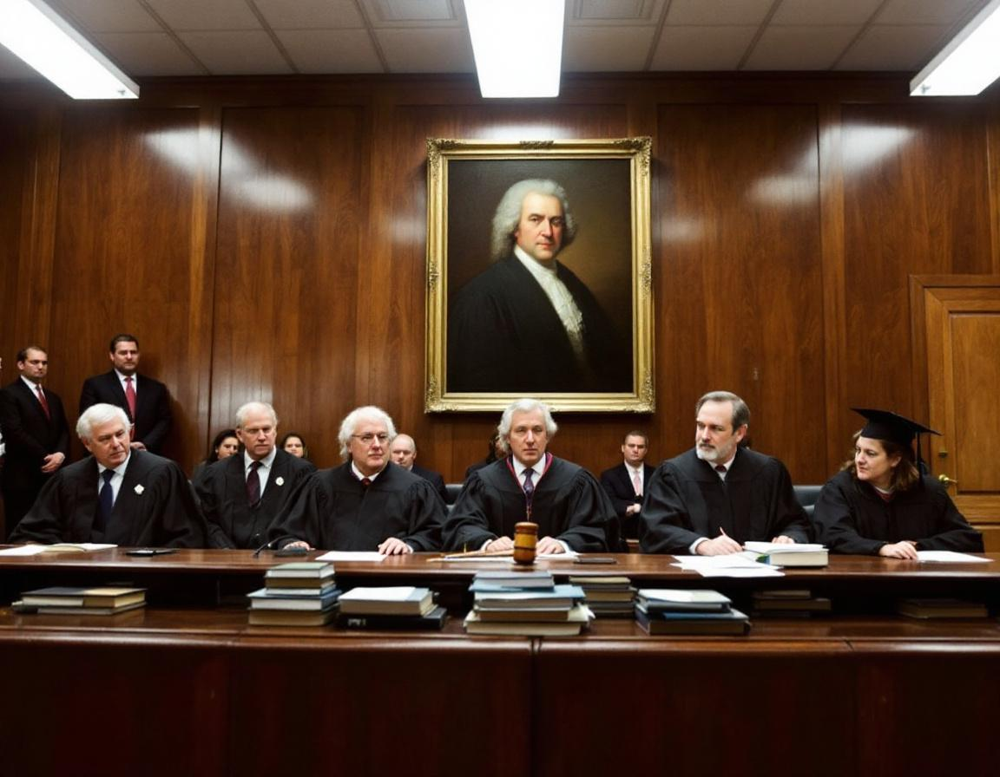

KÖNIGSBERG, Prussia — A special tribunal convened by the International Ethics Tribunal has found the philosopher Immanuel Kant guilty of violating his own categorical imperative, ruling that his lifelong demand that all rational agents ground their moral decisions exclusively in pure practical reason constitutes a standard that no human being can plausibly universalize, and that Kant was fully aware of this at the time.

The verdict, issued Friday following four days of deliberation, concluded that Kant's insistence on evaluating the moral worth of actions solely according to the purity of the maxims underlying them — rather than the motives, circumstances, or cognitive limitations of the agents involved — represented a fundamental breach of his own first formulation of the categorical imperative. "To will that all persons be held to a standard of rational purity that no person has ever demonstrably achieved is to will a contradiction," wrote Chief Adjudicator Dr. Friederike Sommer of the Heidelberg Institute for Applied Moral Philosophy in the tribunal's 340-page opinion. "The defendant expected from others precisely what he exempted himself from having to prove was possible."

The case was brought by a coalition of Kant scholars and former undergraduate ethics students who argued that decades of being graded against an ideal of autonomous rational agency had caused measurable harm to their understanding of their own moral worth. "He basically told everyone that if you acted from inclination rather than duty, your action had no moral value whatsoever," said Professor Lars Grünwald of the University of Tübingen, who served as lead counsel for the plaintiffs. "But when you ask how many people have actually achieved duty-for-duty's-sake, the number is, conservatively, zero. He set an impossible bar and then judged everyone for failing to clear it. That is not a universal law. That is a personality trait."

Kant's estate, represented by a consortium of Kantian scholars from four countries, argued that the categorical imperative was never intended as a description of achievable human behavior but as a regulative ideal toward which rational beings ought to strive. The tribunal rejected this defense, noting that Kant had left no mechanism for partial credit. "In the Groundwork of the Metaphysics of Morals, the defendant is quite clear," said tribunal member Professor Anneliese Vogel, reading from the text during closing proceedings. "An action done from duty has its moral worth not in the purpose to be attained by it, but in the maxim in accordance with which it is decided upon. He meant it. That is the problem." Kant was ordered to issue a clarifying appendix to the Groundwork acknowledging that most people have mixed motives, and was fined one categorical imperative's worth of goodwill, the precise value of which the tribunal declined to specify.
