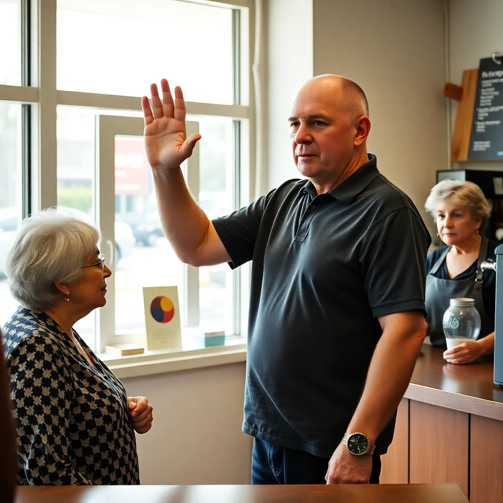

BEAVERTON, Ore. — Kevin Driscoll, a 46-year-old facilities coordinator, has spent the better part of a decade operating under the conviction that "pay it forward" is a morally binding directive to pass along whatever one has recently received — an interpretation that has led him to cut in front of strangers in coffee lines, return aggressive driving in kind to innocent motorists, and, on at least one occasion, hand a warm half-eaten granola bar to a coworker who had done nothing to invite it.

"The whole concept is that you don't let it stop with you," Mr. Driscoll explained in a lengthy interview conducted in his car, which still bore a visible bumper dent from an incident on the 217 that he described as "phase one." "Whether someone buys your coffee or slams a door in your face, the obligation is the same. You find the next person and you pass it on. That's literally what it means. Pay it forward. Forward. To the next person. Whatever it is."

Mr. Driscoll's understanding of the phrase first came to the attention of researchers at the Beaverton Center for Prosocial Behavior in late 2024, when several of his neighbors filed incident reports describing a pattern of behaviors that seemed to follow no discernible moral logic. "In one week, Mr. Driscoll left a casserole on a colleague's porch after receiving a compliment on his tie, and also tailgated a school bus for six blocks after someone failed to hold an elevator," said Dr. Renata Scholl, a social cognition researcher who reviewed the reports. "He appeared equally pleased with himself on both occasions." Dr. Scholl noted that Mr. Driscoll's model of social transmission was "internally consistent, rigorously applied, and almost entirely divorced from the ethical tradition it claims to represent."

Mr. Driscoll says he has no plans to revisit his interpretation, pointing to what he describes as measurable results. Last Thursday, after a barista misspelled his name on a cup, he proceeded to give a man on the street directions that were approximately seventy percent correct, which he logged in a personal journal under the heading "Forward." "Did I make everything perfect for that guy? No," Mr. Driscoll said. "But I kept it moving. And honestly, that's all any of us can do."
