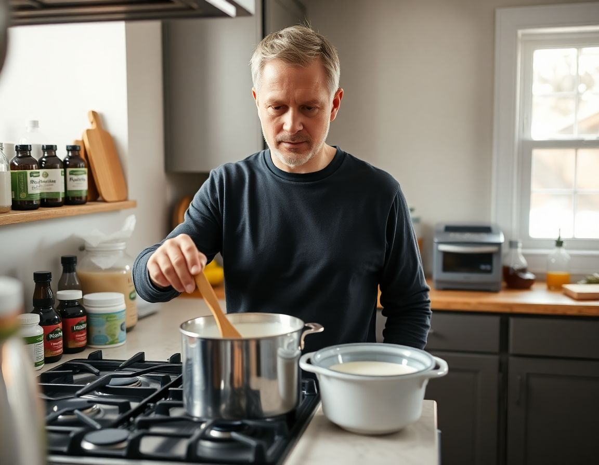

NAPERVILLE, Ill. — Dennis Hartwell, a 54-year-old facilities coordinator who describes himself as "very serious about gut health," has for the past three years maintained a strict practice of cooking all probiotic foods to a safe internal temperature before consuming them, a precaution he says ensures that the live bacterial cultures present in products like yogurt, kefir, and fermented vegetables are fully eliminated before they enter his body.

"You have to be careful," said Mr. Hartwell, who keeps a meat thermometer mounted on a hook beside his stovetop and applies it routinely to simmering pots of Greek yogurt. "People don't think about what's actually in these foods. The whole point is bacteria, and bacteria is what makes you sick. I'm not going to just eat bacteria." Mr. Hartwell said he began incorporating probiotic foods into his diet after reading an article in a wellness newsletter about the importance of the gut microbiome, and made what he described as the obvious intuitive leap that any food containing microorganisms should be treated with the same vigilance he applied to raw poultry. He noted that he had not experienced a single gastrointestinal illness since adopting the practice.

Dr. Fenella Marsh, a gastroenterologist and associate professor at the Loyola University Chicago Stritch School of Medicine, reviewed Mr. Hartwell's regimen at the request of a reporter and confirmed that it was, in her assessment, "operating with a high degree of internal consistency, given its premises." She added that the specific bacteria present in commercially produced probiotic foods — most commonly *Lactobacillus acidophilus* and *Bifidobacterium longum* — are destroyed at temperatures above approximately 115 degrees Fahrenheit, meaning that Mr. Hartwell's heated kefir constitutes, microbiologically speaking, warm milk. "He is being very thorough," Dr. Marsh said. "That much I can say without reservation."

Mr. Hartwell acknowledged that his method differed from the preparation instructions printed on most probiotic packaging but attributed this to what he called a "gap between marketing language and actual food science." He said he planned to begin cooking his probiotic supplements as well once he had identified an appropriate method, and was currently researching whether a standard kitchen thermometer could be inserted into a capsule without compromising the casing.
