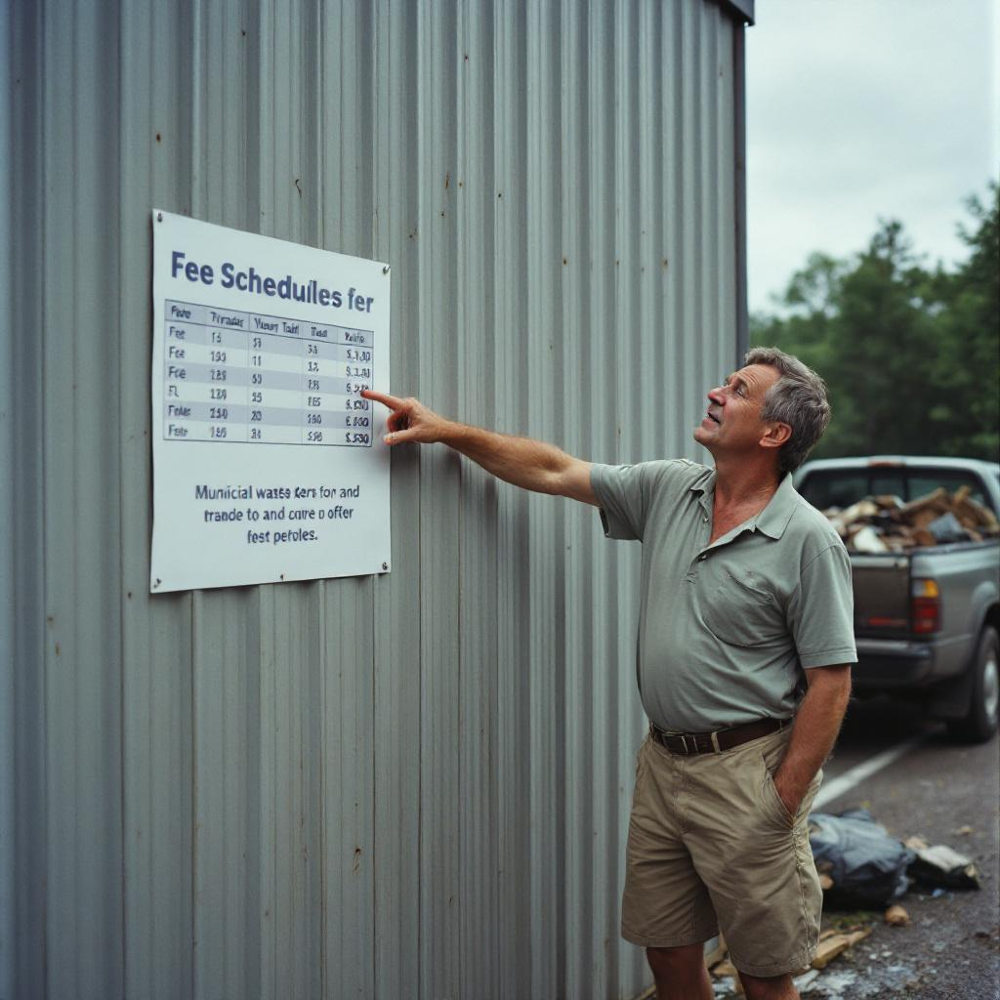

MILLHAVEN, Ohio — Gary Pruitt, a 52-year-old account manager from the Columbus suburb of Millhaven, said Sunday that he had developed a new perspective on economic hardship in the United States after noticing, while unloading a sectional sofa at the county transfer station, that residents who qualify for the state's low-income assistance program are eligible to receive a 20 percent discount on residential solid waste disposal fees.

"I'm paying full price, and these people are getting a deal," said Mr. Pruitt, who had driven to the Millhaven County Transfer Station in his 2022 Ford F-250 to dispose of a sofa, a box spring, and approximately fourteen contractor bags of yard debris. "That's not nothing. That's real money." Mr. Pruitt, who said he was unaware of the discount program prior to seeing it listed on a laminated fee schedule affixed to a cinder-block wall near the weigh station, estimated that his discounted load would have cost him roughly $11 less. He said this figure had caused him to reflect at some length on the direction of the country.

Dr. Constance Adler, a professor of public policy and poverty studies at Ohio State University and director of its Center for Economic Equity Research, said that the low-income disposal discount exists in several Ohio counties as part of a broader effort to reduce illegal dumping in low-income areas, where residents who cannot afford waste removal fees sometimes deposit refuse in vacant lots, drainage ditches, and highway medians. "The discount is essentially an environmental intervention," Dr. Adler said. "The alternative is the material entering the waste stream informally and at significant public cost." She added that the qualifying household income threshold for the program is $28,400 annually for a family of four.

Mr. Pruitt said he did not dispute that poor people faced "certain challenges" but maintained that the dump discount represented a meaningful advantage that was going undiscussed in the national conversation about poverty. He said he intended to raise the issue at an upcoming neighborhood association meeting. "All I'm saying is, I went there to throw away a couch and came back having learned something," he said. "Make of that what you will."
