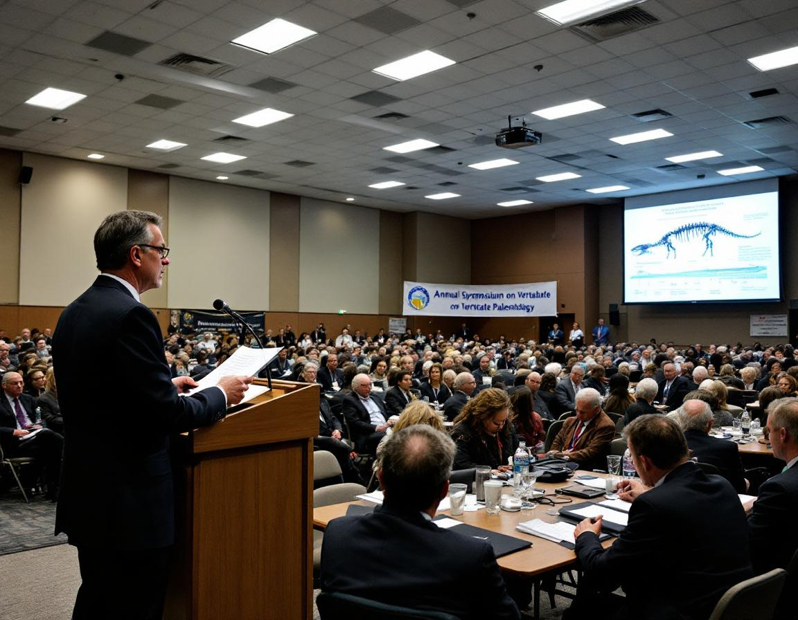

DENVER — The 84th Annual Symposium on Vertebrate Paleontology opened Monday morning not with the customary welcome remarks from the program chair, but with a solemn two-minute land acknowledgment honoring the dinosaurs that, as conference organizer Dr. Raymond Chu noted, "called this ground home for an uninterrupted span of approximately 165 million years before their untimely and, frankly, externally imposed departure."

Dr. Chu, reading from a prepared statement at the podium of the Denver Convention Center's main hall, asked the assembled 1,400 researchers to "take a moment to recognize the theropods, sauropods, and ornithischians whose remains we study, whose bones we excavate, and whose legacy we have, in many ways, built our careers upon." He paused briefly before the projection screen, which displayed a geological timeline stretching from the Triassic to the present, a span he described as "not nothing."

The acknowledgment was greeted with sustained, respectful silence from the audience, and in several sections, a brief round of applause. A small group of attendees seated near the back wore lapel pins bearing the silhouette of a *Triceratops*, which conference materials identified as the symposium's "acknowledgment emblem" for the year. "We are not asking anyone to feel guilty," said Dr. Chu in a brief interview following the opening session. "We are simply asking attendees to sit with the fact that every femur in this building was here before we were."

The acknowledgment text, which was drafted over eighteen months by the symposium's newly formed Committee on Disciplinary Positionality, identifies six major clades by name and includes a passage noting that dinosaurs "did not choose to become the fossil record." Dr. Ingrid Thorvaldsen, a committee member and professor of deep-time ecology at Uppsala University, said the language went through eleven drafts before the committee was satisfied it struck the correct tone. "We wanted to be accurate," she said, "without overstating the degree to which any individual researcher is personally implicated in the K-Pg extinction event." The symposium continues through Thursday, with sessions on avian origins, trackway analysis, and a Friday workshop on ethical sourcing of Mongolian specimens.
