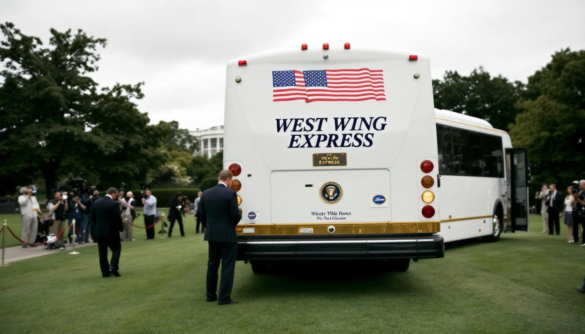

WASHINGTON — The Trump administration has taken what senior officials are describing as a significant step toward operational efficiency, formally commissioning a dedicated transit vehicle on the South Lawn of the White House for the purpose of throwing aides, advisers, and cabinet members under it.

The bus, a forty-two-seat coach finished in pearl white with gold trim and an American flag decal on each flank, was delivered Monday following what sources familiar with the procurement process described as an expedited competitive bidding period. A placard above the windshield reads "West Wing Express." It has not moved since arriving.

"This is about accountability," said Press Secretary Melissa Croft at a briefing Tuesday, standing at the podium with a laminated seating chart she did not show reporters. "The President has always believed in giving the right people the right tools, and frankly, the previous system — which relied on hallway conversations and Sunday show appearances — was creating bottlenecks." She declined to specify who had been thrown under the bus so far, citing personnel confidentiality, but acknowledged the first week had been "very active."

Dr. Raymond Chu, a senior fellow at the Georgetown Institute for Executive Branch Logistics, said the formalization of the process represented a noteworthy departure from historical norms. "Most administrations manage this informally, through background briefings and carefully timed leaks," Dr. Chu said. "What's novel here is the infrastructure commitment. Putting a physical bus on the lawn sends a message — both to allies and to the aides themselves — that the capacity exists and is standing by." He noted that the vehicle's undercarriage clearance of seventeen inches was, by his estimation, "well within operational parameters for the current staff roster."

The White House did not respond to questions about whether the bus would be moved, fueled, or driven at any point, or whether the aides in question were made aware in advance of their inclusion in the process. A senior administration official, speaking on condition of anonymity because they had not been authorized to discuss the matter and were also standing very close to the bus, said the program had "strong internal support," before adding, after a brief pause, "from most people."

Congress has not yet weighed in formally, though Senator Douglas Fairweather of Ohio told reporters outside the Capitol that he had "concerns about the procurement process" and intended to ask the Government Accountability Office to review whether the vehicle met federal transit specifications. Senator Fairweather's office confirmed Wednesday morning that he had revised his statement and no longer had concerns of any kind.
