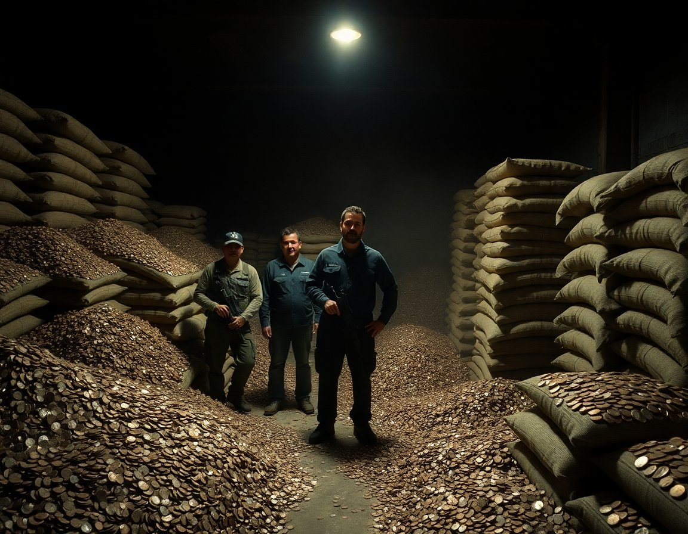

CULIACÁN, Mexico — The abrupt decision by the United States Treasury Department to halt production of the one-cent coin has sent shockwaves through an unexpected corner of the global economy: the Sinaloa-affiliated trafficking syndicate known internally as Grupo Cobre, which for nearly a decade has conducted all of its narcotics transactions exclusively in pennies.

The organization, responsible for moving an estimated 340 metric tons of controlled substances annually through the American Southwest, built its financial infrastructure entirely around the copper-clad coin, according to three senior law enforcement officials who spoke on the condition of anonymity because they were not authorized to discuss ongoing investigations. The cartel's preference for pennies was initially dismissed by analysts as eccentric, but it proved remarkably durable. "They identified an asset so universally undervalued that no one was watching it," said Dr. Margaret Osei-Bonsu, a senior economist at the Center for Illicit Currency Studies in Geneva. "From a money-laundering standpoint, it was genuinely innovative."

At its peak, Grupo Cobre was processing approximately 4.7 billion pennies per year, according to a 2024 assessment by the Financial Crimes Enforcement Network, which noted that the figure represented roughly 12 percent of total annual U.S. penny circulation at the time. The cartel maintained a network of forty-seven counting rooms across three Mexican states, staffed by an estimated 800 employees working in rotating twelve-hour shifts. Senior logistics coordinator Ramón Espinoza Delgado, who was captured by Mexican federal authorities in January and has since cooperated with investigators, described the operation as "a normal business, but with more rolling." The Treasury Department declined to comment on whether Grupo Cobre's penny dependency had factored into the timing of the discontinuation announcement, stating only that the decision was driven by the coin's production cost of 3.69 cents per unit.

With existing supplies now finite and the cartel's reserves estimated at somewhere between 900 million and 1.4 billion coins, economists and law enforcement officials are divided on what comes next. Some believe the organization will pivot to nickels, which carry a per-unit production cost of 13.78 cents and are, in the assessment of Agent Patricia Moultrie of the DEA's Financial Investigations Unit, "at least theoretically available in quantity." Others within the agency are less optimistic. "They built their whole identity around the penny," Agent Moultrie said in a statement released Tuesday. "You can't just switch. These are people who have strong feelings about the penny. Possibly the strongest feelings about the penny of any criminal organization currently operating in the Western Hemisphere."
