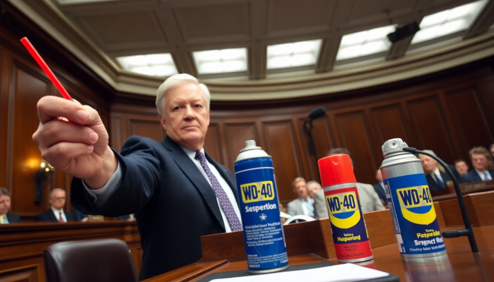

WASHINGTON — In a rare display of bipartisan unity, both chambers of Congress voted unanimously Tuesday to prohibit the storage of WD-40 aerosol cans without the small red plastic applicator straw that is shipped affixed to the side of the can, bringing to a close what supporters called one of the longest-running and most avoidable crises in American consumer hardware history.

The Straw Retention and Applicator Compliance Act, which passed the Senate 97 to 0 and the House 418 to 0 before being signed into law by the President at a Rose Garden ceremony later that afternoon, mandates that all WD-40 cans stored in residential garages, utility closets, workshop spaces, and vehicle gloveboxes must at all times have the red straw within physical proximity of the can, defined in the statute as no more than six inches, or secured to the body of the can using an approved fastening method such as a rubber band, a piece of tape, or the small plastic clip that was included on newer can models and that most users discarded during unpacking. Violators face a civil fine of up to $200, or $400 for repeat offenses.

"We have been warning about this for years," said Dr. Patricia Holloway, a senior fellow at the Institute for Consumer Hardware Safety, who testified before the Senate Commerce Committee during three days of hearings in January. "The straw situation has reached a critical inflection point. We know from longitudinal survey data that once the straw becomes separated from the can — once it goes into the junk drawer, or onto the workbench, or simply into the void — the probability of its recovery within a reasonable timeframe drops to approximately eleven percent. After forty-eight hours, we consider it gone." Dr. Holloway said her organization had documented more than 2.3 million incidents since 2019 in which a homeowner, requiring precision lubrication of a hinge, a door track, or a small mechanical assembly, was forced to spray WD-40 in a broad, undifferentiated cone across an area far larger than intended, attributing the outcome in every case to straw loss.

The legislation has not been without critics. Raymond Chubb, a lobbyist representing the Loose Hardware Storage Association of America, called the law an overreach and argued that the straw, by its nature, resisted containment. "You tape it to the can, it falls off," Mr. Chubb said in a statement released moments after the Senate vote. "You put it in a dedicated cup on the pegboard, your wife moves the cup. You clip it back on, the clip breaks. We are dealing with a force of nature here, not a compliance problem, and no statute is going to change that." Congressional supporters of the bill dismissed these concerns and noted that the law includes a provision establishing a federal Straw Recovery Hotline, staffed seven days a week, through which citizens may report the location of orphaned applicator straws to a national registry.