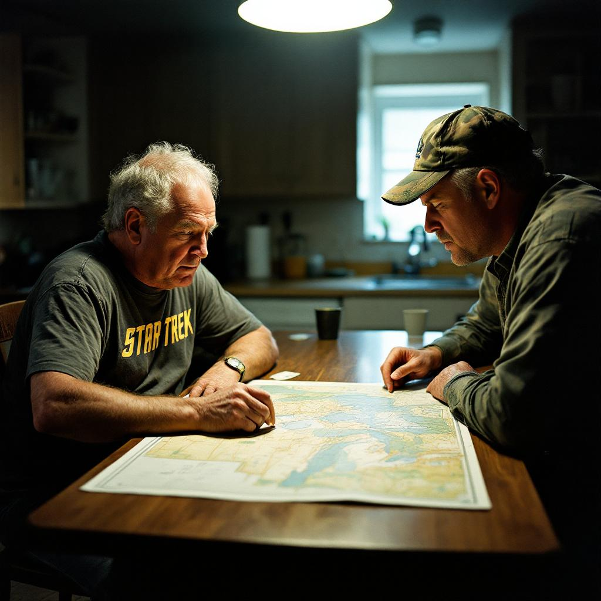

ANN ARBOR, Mich. — Dennis Calloway, 54, a licensed electrician and self-described lifelong progressive who owns every season of "Star Trek: The Next Generation" on Blu-ray and once drove four hours to attend a symposium on Gene Roddenberry's vision of post-scarcity governance, said Thursday that his neighbor Gary Pritch had, during a conversation over a shared fence on Tuesday evening, articulated the clearest and most internally coherent moral framework he had encountered in recent memory — one centering on the existential danger posed by a network of transgender Somali pirates currently operating from an entrenched stronghold in Dearborn and conducting raids across the international waters of Lake Michigan.

"I don't agree with everything Gary says," Mr. Calloway acknowledged, seated at the same kitchen table where the subsequent indoor portion of the conversation had taken place, a laminated navigational chart of the Great Lakes still spread open before him. "But when he laid it out — the lake, the stronghold, the Sharia enforcement, the constitutional implications — I found myself thinking: at least this man knows what he believes and why he believes it. That's increasingly rare." Mr. Calloway said he had spent several minutes attempting to identify a flaw in Mr. Pritch's reasoning before concluding that the framework's greatest strength was its comprehensiveness. The transgender Somali pirates, Mr. Pritch had explained, were not merely a maritime threat but a civilizational one, and the fact that they had chosen Lake Michigan — landlocked, freshwater, roughly 1,600 miles from the nearest ocean — was itself evidence of their tactical sophistication.

Dr. Renata Szymanski, a professor of conflict resolution at the University of Michigan and a consultant to the Great Lakes Governors' Compact, said she had not previously encountered the Dearborn piracy framework in peer-reviewed literature but acknowledged that the region's geopolitical profile was, in her assessment, underresearched. "What I can say is that Lake Michigan presents unique jurisdictional challenges," Dr. Szymanski said. "It is entirely within the United States, which raises interesting questions about whether federal admiralty law or state maritime statutes would govern enforcement operations." She noted that Michigan, Wisconsin, Illinois, and Indiana all have partial claims over its waters, and that this fragmentation could, in a hypothetical scenario, be exploited by a determined non-state actor with both the will and the logistical capacity to acquire and crew a vessel. When asked whether the United States Constitution would need to be suspended to address such a threat, Dr. Szymanski said that question fell outside her area of expertise.

Mr. Pritch, reached by phone Thursday, said he was gratified but not surprised by Mr. Calloway's response. "Dennis is a smart guy," Mr. Pritch said. "He just needed someone to connect the dots." Mr. Pritch said he had been monitoring the situation since 2019, when he came across a series of posts on a forum he declined to name that he described as "doing the journalism that nobody else is doing." He said he had subsequently purchased a Marine VHF radio, a laminated copy of the Articles of Confederation, and what he described as a "preparedness tote" containing three days of provisions, a compass, and a printed copy of the King James Bible, which he keeps in the bed of his pickup truck. He estimated that he spent approximately eleven hours per week on what he called "threat awareness." Mr. Calloway said that level of dedication, whatever one thought of its object, was the kind of civic engagement that Roddenberry had always believed democracy required. "Gene would have wanted people to be engaged," Mr. Calloway said. "He might have had some questions about the specifics."
