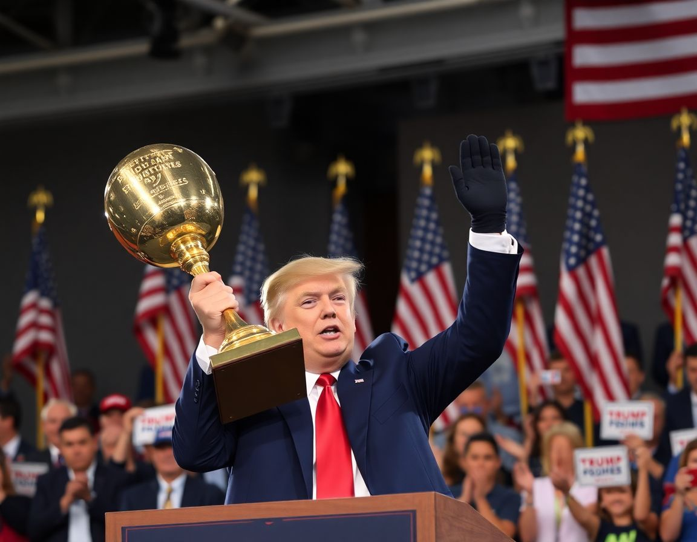

PALM BEACH, Fla. — President Donald J. Trump declared himself on Wednesday the greatest narcissist in the history of the United States, and possibly the world, calling the achievement "frankly, bigger than Lincoln" and suggesting that future generations would study his self-regard the way they study the Renaissance.

"Nobody has ever loved themselves more than me, and that's not even a question," Mr. Trump told supporters at a private gathering at Mar-a-Lago, where staff had prepared a room with enlarged photographs of Mr. Trump at various milestones of his career. "Experts have told me — very prestigious experts, people you've never heard of because they're so exclusive — that there's never been anything like it. Not Napoleon. Not anybody."

The remarks prompted a swift response from mental health professionals, several of whom noted that quantifying narcissism presented significant methodological challenges, though at least one researcher suggested the claim was not without merit. "The literature does describe a theoretical ceiling," said Dr. Franklin Oates, a clinical psychologist at the Harwick Institute for Personality Studies in Bethesda, who added that he had not reviewed Mr. Trump's case personally. "Whether that ceiling has been reached, and by whom, is a question the field has not yet formally taken up, though I would anticipate a number of grant applications in the coming months."

The White House declined to provide documentation supporting the claim but indicated that an executive order was being drafted to establish a Presidential Commission on Ego Supremacy, which would be charged with formally evaluating the historical record and submitting a final determination no later than the end of the fiscal year. A spokesperson noted that the commission's findings would be "beautiful" and that the report, when published, would be the best report ever produced by any government anywhere, and would be printed on extremely good paper.
