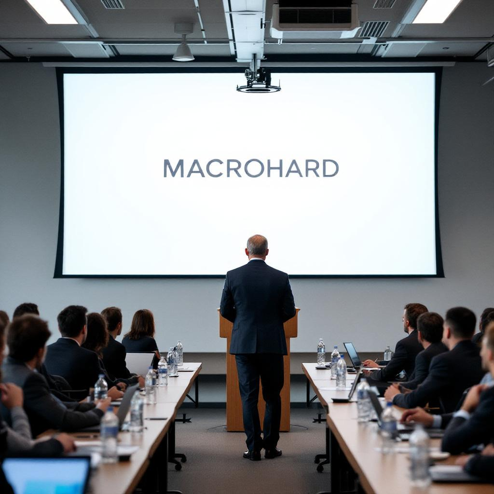

SAN FRANCISCO — Within hours of Elon Musk's announcement Tuesday that his joint Tesla-xAI software initiative would be called "Macrohard" — a deliberate inversion of Microsoft's name chosen, Mr. Musk explained, because the system operates at an order of magnitude beyond anything Microsoft had contemplated — technology executives across the industry convened in emergency strategy sessions to determine how quickly they could adopt the same naming convention for their own forthcoming products, and whether any of the good ones were already taken.

By Wednesday morning, representatives from more than a dozen major technology companies had submitted filings to trademark offices in three countries containing project names structured as single-word inversions of competitor brands. Google, operating under its parent company Alphabet, announced a new data infrastructure initiative called "Alphabit," described in an internal memo obtained by this newspaper as "a system so granular it makes Alphabet look like it's thinking too big." Meta confirmed separately that its next-generation social connectivity platform, currently in development at its Menlo Park campus, will be called "Metafew," a name that a company spokesperson described as "gesturing toward intimacy at scale." Apple declined to comment on reports that a forthcoming hardware project had been internally code-named "Rotten."

"What Mr. Musk has done is identify a very powerful new grammar for product announcement," said Darlene Chu, a senior analyst at the Brand Architecture Institute of Northern California, who has tracked technology naming conventions for eleven years. "The move encodes competitive aggression directly into the product name itself, requires no explanation for anyone who recognizes the source brand, and functions as a kind of declaration of war that is simultaneously deniable as wordplay. It is, frankly, brilliant, and I expect the trend to become essentially mandatory within eighteen months." Ms. Chu said her firm had already been retained by four companies she declined to name — though she noted that one of them had proposed calling its project "Salesfarce" and had been talked out of it by legal.

Not everyone has embraced the convention. A spokesperson for Oracle, reached by telephone Wednesday afternoon, said the company had reviewed the Macrohard announcement and was "not in a position to dignify this approach," before acknowledging, when pressed, that a project tentatively called "Oraclue" had nonetheless advanced to the naming committee and was "under active consideration." Amazon issued a statement noting that the naming trend raised "legitimate questions about trademark dilution and the long-term coherence of brand identity in the enterprise software space," and confirmed that its own forthcoming logistics automation platform, "Amazoff," had been in internal development under that name since January and was therefore "temporally precedent to the current conversation."

Industry observers noted that the momentum appeared difficult to stop. By Thursday, a venture capital firm in Palo Alto had circulated a term sheet for a startup called "Nvidian't," a chip design company whose founding thesis, the document stated, was that "the future of compute does not require your GPU to be on." A separate filing obtained by this newspaper indicated that an OpenAI competitor operating in stealth mode had incorporated under the name "ClosedHuman LLC." The firm declined to comment.
