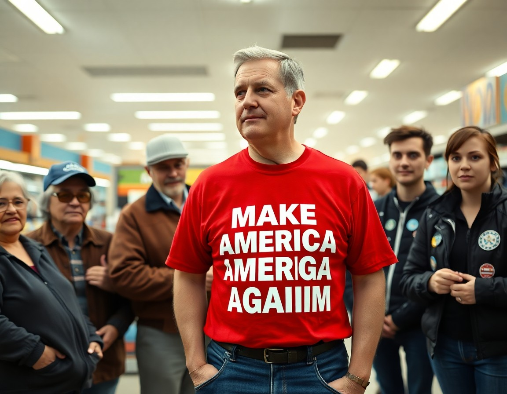

TULSA, Okla. — A man wearing a bright red t-shirt bearing the slogan "Make America Gay Again" in bold white lettering managed to offend, alienate, and infuriate a nearly complete cross-section of the American public during a routine visit to a Brookside-area grocery store on Saturday afternoon, according to multiple witnesses who described the experience as "genuinely impressive in its breadth" and asked not to be named because they did not wish to be associated with any of the parties involved.

The man, identified by store employees as Dennis Prewitt, 47, of Tulsa, entered the store at approximately 2:15 p.m. and proceeded to the produce section, where his garment immediately drew the attention of Ronald and Shirley Bascom, a retired couple from nearby Broken Arrow who told this reporter they found the shirt "deeply offensive and un-American." "I didn't fight for this country so someone could strut around a Reasor's like that," said Mr. Bascom, 71, a Navy veteran, who clarified that he had served during peacetime and had not technically fought for the country in any armed engagement but felt the sentiment stood. The Bascoms left their cart in the cereal aisle and exited the store. By the time Mr. Prewitt reached the dairy case, he had also drawn the sustained disapproval of a group of four graduate students from the University of Tulsa, who told this reporter the shirt was "honestly kind of a lot" and constituted, in the assessment of Margaux Teller, a second-year gender studies candidate, "a reductive commodification of a movement that is currently under serious institutional threat." Ms. Teller said she found the shirt's playful inversion of a campaign slogan "deeply trivializing" and "not the energy we need right now." Her colleague Brennan Forch, who declined to give his field of study, said the shirt was "giving ally theater" and that Mr. Prewitt's apparent self-satisfaction was "part of the problem, honestly."

"He just seemed so pleased with himself," said Carla Nguyen, 38, a dental hygienist who described her own politics as "pretty moderate, I guess," and who encountered Mr. Prewitt near the frozen foods section. "I don't even know what I found more annoying — the shirt, or the way he kept kind of lingering near the end caps like he wanted people to ask him about it." Ms. Nguyen said she did not ask him about it. A manager at the store, who spoke on the condition of anonymity because he was not authorized to comment on customer incidents, confirmed that no policy existed prohibiting the shirt but noted that Mr. Prewitt had been asked to move his cart twice and had on both occasions complied "very slowly." Mr. Prewitt, reached by telephone Sunday evening, said he had worn the shirt because he thought it was funny and that people needed to lighten up. He declined to specify which people.

A spokesperson for the American Retail Apparel Conflict Research Center, a nonprofit that tracks garment-related public disturbances, said Mr. Prewitt's shirt had achieved what researchers refer to as "full-spectrum grievance saturation," a rare condition in which a single article of clothing simultaneously provokes objection from groups with otherwise irreconcilable worldviews. "We see this perhaps three, four times a year," said Dr. William Stroud, the center's director of field studies. "Usually it requires a corporate mascot or a regional sports team. A hand-printed slogan achieving this level of unified disapproval is genuinely unusual." Dr. Stroud said the center would be issuing a full report in the spring.
