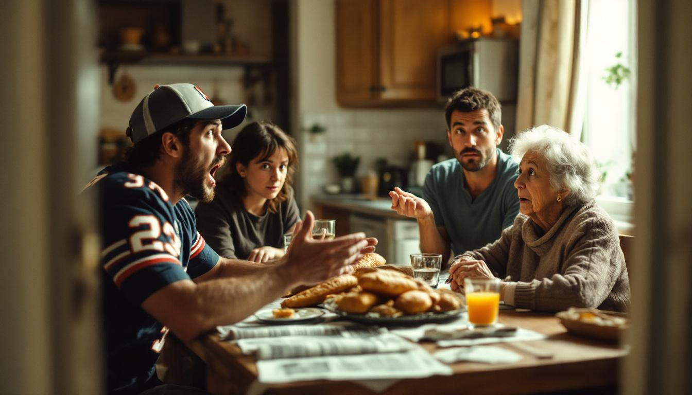

LYON, France — Théodore Barbier-Williams, 26, was born in a hospital in Lyon's 3rd arrondissement, attended French public schools for thirteen years, and has never once left the European continent. He speaks only English.

His parents, both native French speakers with no meaningful command of the language, have been communicating with their son through a combination of hand gestures, Google Translate, and a well-worn Collins French-English dictionary since approximately 2003, when Théodore, then three, began refusing to respond to French and instead started requesting "more juice" and "the blue truck, not the red one" in what his mother described to investigators as "a very clear Midwestern accent."

"We took him to every specialist in the region," said his father, Marc Barbier, speaking through a translator. "The neurologists found nothing. The speech therapists were baffled. It was a priest who finally suggested that perhaps Théodore had lived before, and that his previous self was — how do you say — not finished talking."

The case has drawn the attention of Dr. Helen Ainsworth, director of the Loughborough University Centre for Anomalous Language Acquisition, who has spent eight months studying Théodore and concluded that he exhibits what she calls "persistent anterior-life linguistic override," a condition she acknowledged she invented specifically for this case. "He doesn't just speak English," Dr. Ainsworth said. "He speaks it with the specific cadence and vocabulary of someone who grew up in central Ohio in the early 1970s. He says 'pop' instead of 'soda.' He refers to highway on-ramps as 'ramps.' He once used the phrase 'that dog won't hunt' during a job interview at a boulangerie. He did not get the job."

Théodore himself remains largely unconcerned. "I don't know what to tell you, man," he said during an interview conducted in English at a café near the Rhône, where he ordered a café crème by pointing at the menu. "I've tried to learn French. I took classes. I downloaded Duolingo. But every time I open my mouth, it just comes out like this. My grandmother thinks I'm doing it on purpose. I'm not doing it on purpose."

His grandmother, Colette Barbier, 83, offered a different assessment. "Il le fait exprès," she said.
