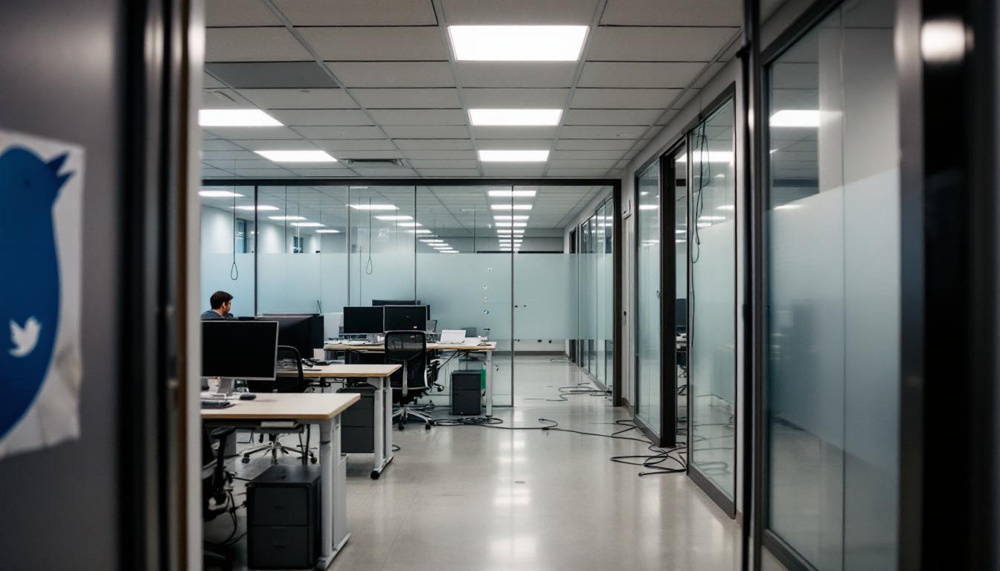

**The Contrarian | By Kristoffer Kitchens**

WASHINGTON — I will say what his critics, in their present fury, have become too dishonest or too embarrassed to admit: Elon Musk was, for a period of approximately fifteen years, the most consequential private citizen on the planet, and he earned the distinction. This is not a concession I make lightly or out of nostalgia. It is a factual prerequisite without which the scale of his subsequent disgrace cannot be properly apprehended. One does not mourn the fall of a mediocrity. One barely notices it. What Musk has accomplished — and I use the word with full awareness of its present irony — is the systematic destruction of a legacy that was, by any honest measure, extraordinary.

Consider what the man built. SpaceX did not merely enter the aerospace industry; it humiliated it. For half a century, the business of reaching orbit had been the exclusive province of governments and their overpriced contractors — a cartel of bureaucratic torpor in which a single rocket launch cost the American taxpayer upwards of four hundred million dollars and the vehicle itself was discarded into the Atlantic like a used napkin. Musk's Falcon 9 flew for sixty-seven million dollars and then — in a spectacle that, the first time one witnessed it, induced a sensation not unlike religious conversion — landed itself on a barge in the ocean and flew again. The Starship program, whatever its delays and its explosions, represented the first credible architecture for making humanity a multiplanetary species since the Apollo engineers retired to write their memoirs. NASA, the institution that had put men on the moon with slide rules and sheer national will, was by 2020 booking seats on Musk's rockets because it could no longer build its own at any price Congress was willing to pay. One may dislike the man. One cannot, if one is honest, dislike the rockets.

Tesla was, if anything, the more improbable achievement. The last American automobile company to succeed had been founded in 1925. Every subsequent attempt — DeLorean, Tucker, Fisker, and a graveyard of others whose names survive only in bankruptcy filings — had ended in failure so predictable that it had acquired the force of natural law. The Detroit establishment regarded the electric car with the particular contempt that guilds reserve for heresy: it was not merely impractical, they insisted, but a violation of the covenant between the American consumer and the internal combustion engine. Musk did not argue the point. He simply built the Model S, a machine so self-evidently superior to its gasoline competitors that it rendered the debate moot. By 2021, Tesla was the most valuable automaker on Earth — worth more than Toyota, Volkswagen, and General Motors combined — and the entire global automotive industry was scrambling to electrify its fleets in a pivot so sudden and so total that it constituted, in effect, an admission that Musk had been right and they had been wrong about the central technological question of their own industry for the better part of two decades. That is not mere success. That is the kind of vindication that arrives, at most, once in a generation, and usually to people who are already dead.

He was, to be plain about it, the Thomas Edison of his era — if Edison had also built the rocket that delivered the telegraph wire. The emerald-mine canard and the "he's not really an engineer" objections, beloved of his detractors, always missed the point in the way that deeply unserious people miss the points of deeply serious accomplishments: it does not matter whether he personally designed the Merlin engine or hand-wound the battery cells. What matters is that he identified, with a clarity that bordered on clairvoyance, the two industries most consequential to the long-term survival of the species — energy and spaceflight — and then built companies that transformed both, in the teeth of opposition from every incumbent, every regulator, and every pundit who had made a comfortable living explaining why such things could not be done. The man who walked into Twitter's headquarters in October of 2022 carrying a porcelain sink and grinning like a teenager who had just stolen his father's car was, at that moment, the most important industrialist since Henry Ford. He had earned the grandiosity. That is precisely what makes everything that followed so unforgivable.

Consider the trajectory. In October of 2022, Musk completed his forty-four-billion-dollar acquisition of the platform, a sum so grotesque that it retroactively made every prior act of billionaire vanity — the yachts, the islands, the suborbital joyrides — look like the quiet prudence of a man clipping coupons. He had purchased, at a valuation roughly four times what the company was worth, the world's most toxic comments section, and he was evidently delighted. What followed was not a corporate turnaround but a masterclass in what happens when a man who has been told he is a genius by a sufficient number of people on the internet begins to believe it about matters beyond his competence — which is to say, about nearly everything.

The layoffs came first: eight thousand employees reduced to fewer than fifteen hundred, entire departments eliminated with the strategic precision of a man swinging a cricket bat in a china shop. Trust and safety — gutted. Content moderation — gutted. Communications — gutted, though one suspects the communications team had, by that point, nothing left to communicate except a plea for mercy. He then replaced the platform's identity verification system with an eight-dollar-a-month subscription, a decision so pitilessly stupid that within hours trolls were impersonating Eli Lilly, Nintendo, and — in a touch that even the most committed satirist would have rejected as too on the nose — Lockheed Martin. Advertisers fled. Disney, Apple, Volkswagen, General Mills — one by one they departed, not in protest but in the simple self-preservation of brands that could read a room. By the time Fidelity marked down its investment by seventy-nine percent, the trajectory was no longer a decline but an archaeological excavation, each quarter revealing a deeper stratum of ruin.

It will not do to pretend that the destruction of Twitter — rebranded, with the solemnity of a man renaming his divorce attorney's office, as "X" — was merely a business failure. Business failures are common, and most are boring. What Musk accomplished was rarer and more comprehensive: he took the global public square, with all its deficiencies and all its genuine utility, and converted it into a megaphone for his own increasingly unhinged enthusiasms. He reinstated Donald Trump. He reinstated Alex Jones — a man Musk had previously refused to platform, citing the death of his own child from SIDS, a principle he abandoned after conducting a Twitter poll, which is to say that he submitted the question of whether to amplify a man who tormented the parents of murdered children to the considered judgment of his own reply guys. He reinstated Andrew Tate. He welcomed back Kanye West after the antisemitic tirades, because free speech, one supposes, is a principle that applies with particular force to billionaires who agree with you.

And then — because the descent, like the man, cannot resist acceleration — he endorsed the antisemitism himself. In November of 2023, when a user posted a conspiracy theory claiming that Jews "push dialectical hatred against whites," Musk replied with two words that will serve as his epitaph in any honest accounting: "the actual truth." The White House called it abhorrent. Far-right and white nationalist groups called it something else: vindication. One might be forgiven for thinking that a man who had built his fortune on the labor of immigrant engineers in a country that admitted his own immigrant self might hesitate before lending his platform — his hundred-and-ninety-million-follower platform — to the most ancient and tedious of all hatreds. One would be wrong. Musk does not hesitate. Hesitation would require the kind of reflective capacity that he has, by this point, replaced entirely with posting.

The inauguration of January 2025 provided the gesture that the situation had long demanded. Standing before a crowd of supporters, Musk placed his hand over his heart and then extended his arm in a straight, rigid salute — palm flat, fingers together — twice. The resemblance to a gesture last seen in wide use in Nuremberg was, one is assured, entirely coincidental. Neo-Nazi groups, who are evidently less sophisticated in their semiotics than the Anti-Defamation League, celebrated it as exactly what it looked like. Musk's response was to post a series of Nazi-themed puns to his two hundred million followers, which is the kind of thing that one does, presumably, when one has lost the ability to distinguish between edginess and complicity — a distinction that, it must be said, was never his strong suit.

But the salute was merely theater. The real damage was bureaucratic. The Department of Government Efficiency — an entity whose name is itself a contradiction in terms, given that it was led by a man who had just destroyed eighty percent of the value of his most recent acquisition — was established by executive order on the day of Trump's inauguration, and Musk was placed at its helm. What followed was a campaign of destruction so indiscriminate that it would have embarrassed Alaric. DOGE employees accessed Treasury Department payment systems containing the Social Security numbers and banking information of millions of Americans. They fired inspectors general — including, in a coincidence so brazen it borders on parody, inspectors general who were investigating Musk's own companies. They gutted USAID, an act that, by the estimates of epidemiologists who study such things, contributed to the deaths of hundreds of thousands of people — mostly children, mostly in countries that Musk could not locate on a map, mostly from diseases that cost pennies to prevent. Musk claimed twenty million Americans were receiving Social Security benefits past the age of one hundred, calling it "the biggest fraud in history." It was, in fact, a misunderstanding of a database — the kind of error that a competent intern would have caught and that the world's self-proclaimed smartest man broadcast to the planet as revelation.

The numbers, as Orwell might have noted, are the most pitiless witnesses. Tesla — the company that was supposed to render the internal combustion engine obsolete, the company that was valued as though it had already won — lost fifteen billion dollars in brand value in 2025. Sales declined for the second consecutive year. In California, the company's spiritual homeland, its share of new registrations dropped below ten percent. The "Tesla Takedown" movement organized protests at more than two hundred and fifty cities worldwide. Owners affixed bumper stickers reading "I bought it before Elon went nuts," which is, as a piece of cultural commentary, more concise than anything I am capable of producing. Showrooms were besieged. Cybertrucks — those stainless-steel testaments to the proposition that an automobile can be both ugly and fragile — were vandalized with such regularity that one began to suspect the design itself was an invitation.

He meddled in European elections, endorsing the Alternative for Germany — a party founded by people nostalgic for a period of German history that most Germans have spent eighty years trying to live down — and told Germans there was "too much focus on past guilt," a sentence so historically illiterate that it would have earned a failing grade in a secondary school in any country that takes its past seriously, which is to say any country except the one currently employing him. He called the German Chancellor a fool. He hosted the AfD leader on his platform. French police investigated whether his algorithm was being deliberately tuned to amplify the far right, a question to which the answer was — to anyone who had spent five minutes on the platform — so obviously yes that the investigation felt less like journalism than like a formality.

And then came the falling out with Trump, which had the quality of a Jacobean tragedy performed by men who had not read the script. Musk criticized Trump's spending bill; Trump told him to go back where he came from; Musk announced the formation of a new political party called, with the grandiosity that is his substitute for gravitas, the "America Party." He never registered it with the FEC. By autumn they had reconciled, because in the world these men inhabit, ideological conviction is a costume one wears to a fundraiser and removes in the car.

It is fashionable, in certain quarters, to attribute Musk's degradation to the corrupting influence of power, or to the isolation of wealth, or to the sycophancy of the online mob. These explanations are insufficient. The truth — the actual truth, since Mr. Musk has demonstrated such enthusiasm for the phrase — is simpler and more damning. Elon Musk was a man of genuine, if narrow, talent who committed the one sin that talent cannot survive: he became convinced that excellence in one domain conferred authority in all others. He could land a rocket, and therefore he could run a social media company. He could build an electric car, and therefore he could restructure the federal government. He could engineer a battery, and therefore he could decode the geopolitics of the Middle East, the economics of foreign aid, and the moral weight of a straight-armed salute before a crowd of cheering partisans. This is not hubris in the classical sense — the Greeks, who understood these matters better than we do, reserved hubris for those who defied the gods. Musk has not defied the gods. He has simply confused himself with one, which is a more American failure and, in the end, a more pathetic one.

The rockets still land. The cars still drive. The tunnels — well, the less said about the tunnels, the better. But the man who set those things in motion has spent the last three and a half years proving, with the tireless energy he once devoted to engineering, that there is no accomplishment so great that it cannot be buried beneath a sufficient volume of tweets. He has jumped the shark, as the American idiom has it — though in Musk's case, the shark was a whale, and he did not so much jump it as purchase it for forty-four billion dollars, rebrand it, fire its staff, and then set it on fire while saluting.

One does not mourn the loss. One merely notes it, as one notes the weather, or the passage of time, or the slow and unremarkable extinction of a species that was, for a brief moment, genuinely remarkable.
