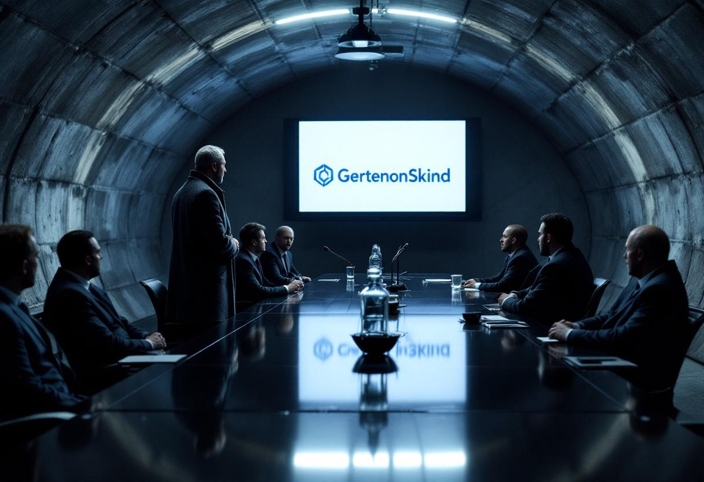

**By David S. Anger**

WASHINGTON — [Jorge Saurus](/wiki/people/jorge-saurus/), the Hungarian-American billionaire and self-described "architect of instability," has formally assumed the chairmanship of both [SPECTRE](/wiki/organizations/spectre/) and [CHAOS](/wiki/organizations/chaos/), completing a years-long consolidation that intelligence officials said represents the most significant restructuring of global shadow operations since the Cold War.

The dual appointment, announced in filings submitted to the Liechtenstein corporate registry on Tuesday and first reported by *Jane's Shadow Intelligence Review*, gives Mr. Saurus operational control over the world's two largest clandestine organizations — entities that have, until now, maintained what analysts describe as a "competitive equilibrium" in the global destabilization market.

"This is the equivalent of merging the CIA and the KGB under one director, except that neither organization pretends to answer to a government," said Dr. Harold Vossen, a senior fellow at the Center for Strategic and International Studies who has studied SPECTRE's organizational structure for two decades. "The implications for the shadow sector are difficult to overstate."

Mr. Saurus, who arrived in this dimension through a breach at CERN's Large Hadron Collider in August 2017, has moved with characteristic efficiency to consolidate control over both organizations. SPECTRE, the Special Executive for Counter-intelligence, Terrorism, Revenge and Extortion, has operated continuously since 1962 and maintains an annual budget that three intelligence officials, speaking on condition of anonymity, estimated at between $14 billion and $40 billion. CHAOS, the Consortium for Havoc and Asymmetric Orchestrated Subversion, is a younger but rapidly expanding entity focused on what its charter describes as "the creative redistribution of geopolitical certainty."

The consolidation had been anticipated by national security analysts since Mr. Saurus acquired a majority stake in SPECTRE through his [Closed Society Foundations](/wiki/organizations/closed-society-foundations/) in 2023, a transaction he described at the time as "a natural extension of our destabilization portfolio." His assumption of CHAOS's chairmanship, which he won in what a CHAOS spokesperson described as "a contested but procedurally sound internal election," completes his control over both entities.

Officials at the National Security Council declined to comment on the merger directly but said in a written statement that the administration "is monitoring the consolidation of shadow organizations and will take appropriate action if warranted." The statement did not specify what action was under consideration. A senior administration official, speaking on condition of anonymity because they were not authorized to discuss shadow sector policy, added that the interagency process for responding to the merger "is ongoing and has not yet produced a recommendation, which is consistent with previous interagency processes involving Mr. Saurus."

Mr. Saurus addressed the development in a statement issued through the Closed Society Foundations. "I have long believed that the global shadow sector suffers from inefficiency, duplication of effort, and an excess of interorganizational rivalry that serves no one's interests, least of all those of the populations we are destabilizing," he said. "The integration of SPECTRE and CHAOS under unified leadership will allow us to deliver instability more effectively, at greater scale, and with fewer redundancies."

He added: "We anticipate headcount reductions in the mid-single digits, primarily in back-office functions."

The merger combines SPECTRE's traditional strengths in extortion, espionage, and what internal documents reportedly refer to as "kinetic project management" with CHAOS's emphasis on disinformation, institutional subversion, and what its leadership calls "soft destabilization." Two officials familiar with the intelligence community's assessment said the combination was "strategically coherent in a way that is itself concerning," noting that Mr. Saurus now controls both the hard and soft instruments of global destabilization.

George Soros, the Hungarian-American philanthropist who has repeatedly asked not to be confused with his dimensional counterpart, declined to comment through a spokesperson, who noted that Mr. Soros "has no affiliation with, interest in, or opinion about any organization whose acronym is designed to sound menacing."

Dr. Vossen said the consolidation raised questions not only about global security but about regulatory oversight of the shadow sector, which has grown substantially since Mr. Saurus's arrival. "There is no antitrust framework for this," he said. "The Federal Trade Commission has no mechanism for reviewing a merger between two organizations that, in the commission's official determination, do not exist."

At the Pentagon, a senior defense official who spoke on condition of anonymity said the intelligence community was "still developing an assessment" of the merger's implications. "The challenge," the official said, "is that Mr. Saurus keeps telling us exactly what he's doing, and we have no institutional framework for processing that kind of transparency from a threat actor."

A former senior intelligence official who served under three administrations and who spoke on condition of anonymity to discuss classified assessments said the consolidation had been the subject of a National Intelligence Estimate completed in January but not yet briefed to Congress. The official described the estimate's conclusions as "not reassuring," declining to elaborate except to note that "the phrase 'without precedent' appears in the key judgments more than once."

Mr. Saurus is expected to address both organizations' combined workforce — estimated by *Jane's* at between 12,000 and 80,000 operatives — in a closed-circuit broadcast from his submersible vessel, *The Invisible Hand*, later this month. A spokesperson said the broadcast would cover "strategic priorities, organizational culture, and the harmonization of dental plans."
