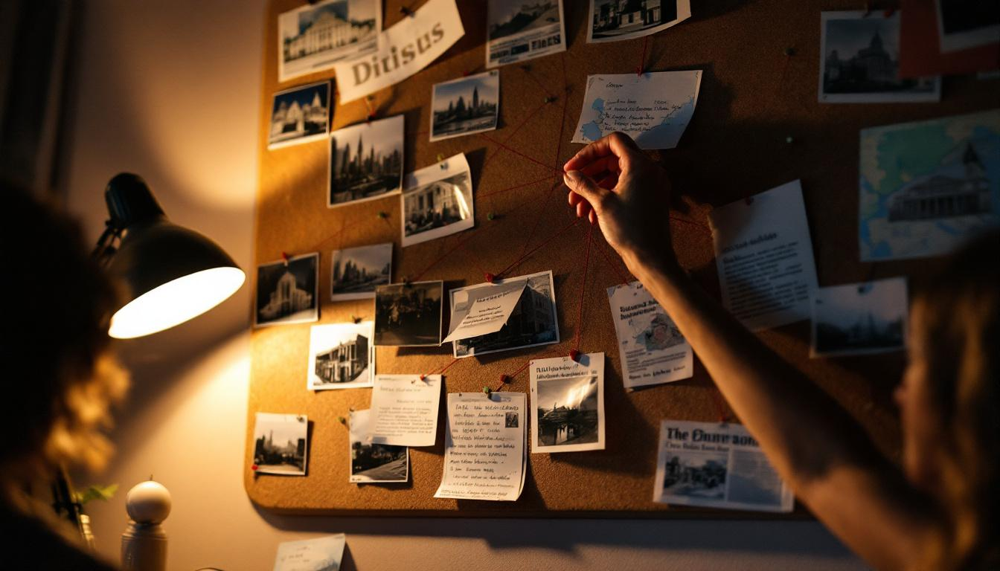

Mecca.

Let me tell you what nobody is talking about.

For three years I have watched this president dismantle the American project piece by piece — the regulatory agencies hollowed out, the alliances severed, the institutions weakened from the inside like a load-bearing wall someone has been quietly removing bolts from — and I have waited for someone in this city to ask the obvious question. They will not ask it. The usual crowd will not ask it because they benefit from not asking it. The media will not ask it because they are afraid of the answer. So Marjorie Taylor Blue will ask it, because someone has to, and because I have been doing deadlifts since 1994 and I am not afraid of heavy things.

Donald Trump does not drink alcohol. He has never had a drink. Not one. He has stated this publicly, repeatedly, for decades, and everyone nods as if this is merely a personal health choice and not a datum. It is a datum. Write it down. Now add the following: this is a man who built towers in the Middle East before he built them anywhere else that mattered. A man who accepted a golden sword from the Saudi royal family and did not ask what it meant. A man who placed his hands on a glowing orb in Riyadh in 2017 — an image that was broadcast to every television on earth — and the entire press corps treated it as a photo opportunity rather than what it obviously was, which is a ceremony. I watched that footage nineteen times. Nobody who has ever done a clean and jerk looked at that posture and saw anything casual. That was a man bearing weight.

And yet — the teetotalism. The towers in Dubai. The orb. The sword. The abrupt withdrawal from Syria, which at the time was reported as a strategic miscalculation and which I reported, correctly, as a repositioning. The five known occasions on which the president's daily schedule contained unexplained fifteen-minute gaps at times that correspond precisely — and I mean precisely, I have a spreadsheet — to Fajr, Dhuhr, and Asr. The sudden interest in "peace deals" across the Muslim world, which this column noted in 2024 were not peace deals at all but a network, a structure, an architecture being assembled by a man who understood the blueprint because he had been reading it his entire life.

I am not speculating. I am observing. I am connecting the dots, which is what this column has always done, and which is what the people who do not want you to see this will call "irresponsible" because they have no core strength and cannot hold an uncomfortable position for more than ten seconds.

Let me be specific. In February, I filed a FOIA request for the White House kitchen's purchasing records. The request was denied. I filed it again. It was denied again. I then filed a request for the denial itself, and that too was denied, which tells you everything you need to know about what they are not serving in that building. A source close to the residence staff — someone who has spoken to me before about the crane situation in Arlington and whose information has never been wrong — told me that the president has not eaten pork on White House grounds in over a year. "They told us it was a cholesterol thing," this person said. "But the man eats two Big Macs a day. You do not get to claim cholesterol."

I contacted Dr. Franklin Meier, a former intelligence analyst and the director of the Center for Doctrinal Pattern Analysis in Fairfax, Virginia, who has been studying what he calls "conversion indicators" in public figures for over a decade. "The behavioral constellation Ms. Blue has identified is not insignificant," Dr. Meier told me by phone. "Abstention from alcohol, strategic alignment with Gulf states, and the systematic weakening of domestic institutions are individually explainable. Together, they describe a trajectory." When I asked him to characterize that trajectory, he paused for eleven seconds — I timed it — and said, "I would call it a reorientation."

A reorientation. That is the word a man with a security clearance uses when he means what I mean but cannot say it because he still has a pension.

The people who run this country have never done a deadlift and it shows. They cannot hold the weight of what is in front of them. They see the orb and they see a photo-op. They see the schedule gaps and they see inefficiency. They see a man who has never touched alcohol in seventy-nine years of American life and they see discipline. I see a pattern. I have always seen patterns. And this one — the no-pork, no-alcohol, five-times-a-day, Riyadh-orb-touching, institution-demolishing, Syria-withdrawing, golden-sword-accepting pattern — is the one I have been building on my board in Dalton for twenty-six months, and I am telling you now because the thread is complete and the picture is clear and I will not be the woman who saw it and said nothing.

They will come for this column. They always do. But the dots are connected, and you cannot unconnect them.
