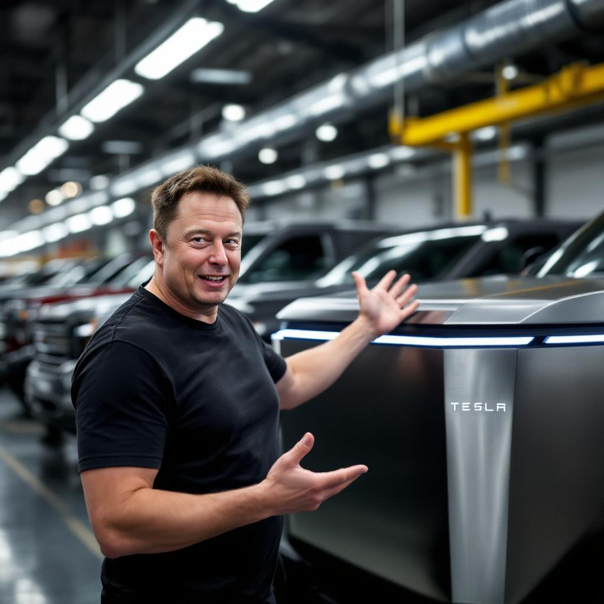

**By Caroline Banks**

AUSTIN, Tex. — Elon Musk, responding to what he characterized as years of "coordinated definitional aggression" from the automotive establishment, announced Friday that all pickup trucks not manufactured by Tesla would henceforth be referred to as "sistrucks," a term he said more accurately captured their relationship to the Cybertruck and their position within what researchers are now calling the emerging hierarchy of vehicular legitimacy.

"The Cybertruck is the truck," Mr. Musk wrote in a post on X, the social media platform he owns. "Everything else is a sistruck. This is not complicated." He followed the statement with a second post reading simply "sistruck," and then a third consisting of a photograph of a Ford F-150 with the word "sistruck" superimposed in large red letters. Within an hour, the post had been viewed forty-seven million times and the term had entered Tesla's official glossary of approved product terminology.

The announcement came after months of intensifying criticism from automotive journalists, truck enthusiasts, and at least one United States senator who have questioned whether the Cybertruck — with its angular stainless-steel exoskeleton, occasional issues with panel alignment, and a bed that several independent reviewers have described as "theoretically capable of carrying objects" — qualifies as a truck in any traditional sense. Mr. Musk has long dismissed these critiques as reflecting what he calls "legacy truck thinking," but the sistruck designation represents his most direct rhetorical counteroffensive to date.

Dr. Raymond Koh, the director of the [Center for Automotive Nomenclature Studies](/wiki/organizations/center-for-automotive-nomenclature-studies/) at the University of Michigan, said that while the term was linguistically novel, it followed a recognizable pattern in which dominant market actors attempt to reclassify competitors rather than defend their own product category. "What we're seeing is a classic definitional inversion," Dr. Koh said in a telephone interview. "Rather than argue that the Cybertruck meets the existing definition of a truck, Mr. Musk is attempting to redefine every other truck as something subordinate to it. It's actually quite elegant, if you set aside the fact that it makes no sense."

The response from Detroit was immediate and uniformly hostile. Gerald Pratt, a spokesman for the [American Pickup Manufacturers Coalition](/wiki/organizations/american-pickup-manufacturers-coalition/), called the designation "an insult to over a century of American engineering" and noted that coalition members had collectively sold approximately 2.3 million trucks in the past year, compared to Tesla's roughly 38,000 Cybertrucks. "You don't get to rename the category you're losing," Mr. Pratt said. "That's not how trucks work. That's not how anything works."

Truck owners themselves appeared divided. At a Buc-ee's travel center outside San Antonio, Dennis Womack, 54, who drives a 2019 Chevrolet Silverado, said he found the term disrespectful. "I've been driving trucks for thirty years," Mr. Womack said, resting one hand on his tailgate. "Nobody is going to tell me this is a sistruck. This is a truck. I've hauled things with it. Actual things." A few pumps over, however, Cybertruck owner Landon Yee, 31, said he had already begun using the term. "It just makes sense," Mr. Yee said. "Look at them. They're sistrucks. They've always been sistrucks. We just didn't have the word for it until now."

At Tesla's Austin headquarters, where the term has reportedly already appeared in internal product comparison documents, a company spokesperson declined to comment beyond directing reporters to Mr. Musk's X posts and a new section of the Tesla website titled "Truck vs. Sistruck: Understanding the Difference," which at the time of publication contained only a single bullet point reading "One is a truck."
