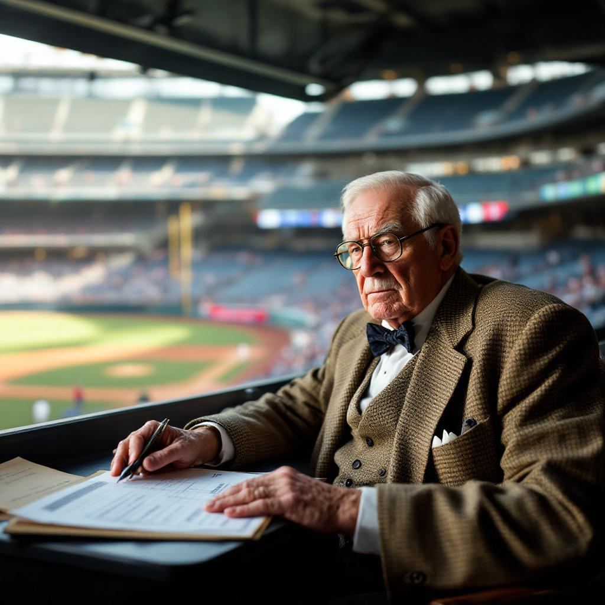

WASHINGTON — It is a fact insufficiently appreciated that the prohibition against crying in baseball is not merely a cultural preference but a foundational principle — one that predates the designated hitter, the wild card, and nearly every other institutional degradation visited upon the national pastime in the past half century. The rule is unwritten, which is to say it is more binding than any rule that has been written, because it derives its authority not from a committee but from the structure of the game itself. One does not cry in baseball for the same reason one does not filibuster a sacrifice bunt: the architecture of the enterprise does not permit it.

It bears remembering that the Founders, though they did not play baseball — a biographical deficiency that diminishes them only slightly — understood the principle at work. Madison, in Federalist No. 51, observed that "ambition must be made to counteract ambition," a formulation that applies with equal force to the dynamic between a base runner and a catcher in a tag play at the plate. The base runner may be aggrieved. The call may be incorrect. The umpire may possess the visual acuity of a man reading a broadsheet in a thunderstorm. And yet one does not cry. One returns to the dugout. One sits on the bench with the compressed dignity of a man who has been wronged by the system and intends to address it through proper channels, which in this case means hitting a double the next time up.

The matter has been raised again this spring by a regrettable incident in the Grapefruit League, in which a utility infielder for the Tampa Bay Rays was observed wiping tears from his eyes after being called out on a checked swing in the fourth inning of an exhibition game against the Minnesota Twins. The footage, captured by a fan and distributed with the viral efficiency of a constitutional crisis, prompted a week of commentary that has been, in every particular, wrong. "There is nothing wrong with showing emotion on the field," said Dr. Vanessa Hartwell, a sports psychologist at the University of Michigan and the author of *Feelings in the Outfield: Emotional Intelligence and the Modern Athlete* (Penguin, 2024). "The stigmatization of tears in athletic contexts reflects an outdated and frankly harmful model of masculinity that we should be working to dismantle."

One notes, with the patience of a man who has watched thirty-seven hundred baseball games and wept at none of them, that Dr. Hartwell is mistaken. She is not mistaken about masculinity, which is a subject on which I claim no particular expertise and which falls outside the scope of this column, as it falls outside the scope of baseball. She is mistaken about the nature of the prohibition. The rule against crying in baseball is not a regulation of emotion. It is a regulation of *form*. Baseball is a game of structure — of innings, of outs, of the geometrically precise ninety feet between bases, a distance that Gouverneur Morris himself would have admired for its elegant sufficiency. Within this structure, certain behaviors are permitted and others are not. One may argue with an umpire, provided the argument is conducted at sufficient volume and concludes with the ejection of one or both parties. One may throw one's helmet, provided it is thrown with conviction and not at anyone in particular. One may sit in the dugout with one's head in one's hands, staring at the concrete floor with the thousand-yard gaze of a man contemplating the void. These are all acceptable expressions of the interior life of a ballplayer. Crying is not; it is a category error, an importation into baseball of a mode of expression that belongs to other arenas — to funerals, to the final pages of certain novels, and to the moment when one realizes that the designated hitter is, in all probability, permanent.

Consider the analogy of the constitutional convention. The delegates in Philadelphia in the summer of 1787 faced setbacks of considerable magnitude. The Virginia Plan was opposed. The New Jersey Plan was inadequate. Roger Sherman's compromise was exactly the kind of expedient that satisfies no one and endures forever, which is to say it was the most American thing that happened that century. And yet there is no record of any delegate crying. Not because they were not moved — they were men of deep feeling, Hamilton perhaps excessively so — but because the enterprise in which they were engaged demanded a certain comportment. The convention, like baseball, was a system of rules designed to channel passion into productive form, and tears are not a productive form. They are a leakage; a structural failure in the load-bearing wall of composure that separates organized competition from mere feeling.

I do not say this without sympathy. I have, in my years of keeping score — a practice I have maintained without interruption since 1962, when I attended my first game at Milwaukee County Stadium and recorded, in pencil, a 4-3 Braves victory over the Phillies that I can still reconstruct from memory with the clarity of a man who has forgotten nothing because he wrote everything down — I have witnessed moments of extraordinary poignancy on the diamond. The final at-bat of a career. The error that ends a season. The long walk from the mound to the dugout after a relief pitcher has surrendered the lead in the seventh inning of a game that mattered. These are moments that test the composure of any person of feeling. And the correct response to them is the response that baseball has always demanded: the tip of the cap, the slap of the glove against the thigh, the slow walk with the head down and the jaw set, and then silence. This is not the suppression of emotion. It is the *refinement* of emotion — its distillation into a form worthy of the game, which is to say worthy of the republic, which is to say worthy of us at our best; a point that Madison, had he lived to see a pennant race, would surely have understood.
