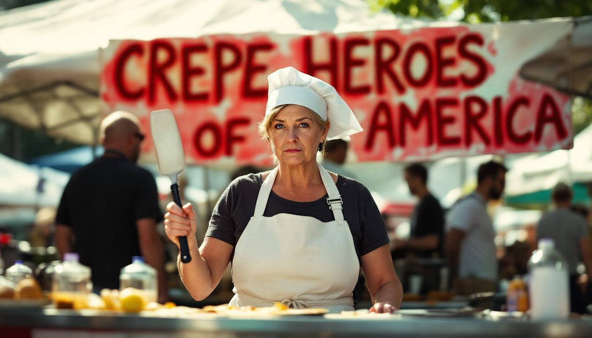

What's all this fuss I keep hearing about how not all heroes wear crepes?

YONKERS, N.Y. — I would like to know who started this conversation, because I have a few things to say about it.

Of course not all heroes wear crepes. That is obvious. Some heroes wear aprons. Some heroes wear hairnets. Some heroes wear those little paper hats they give you at the concession stand at Rye Playland, which, by the way, they stopped doing in 2019, and nobody said a word. But the implication — the dangerous implication — that wearing a crepe somehow disqualifies a person from heroism is exactly the kind of thinking that is tearing this country apart.

I have known crepe-makers my entire life. My late husband, Richard, God rest him, made crepes every Sunday morning for thirty-four years. He used a twelve-inch nonstick pan he bought at a tag sale in Dobbs Ferry in 1987, and he never once asked for recognition. He did not consider himself a hero. But when he stood at that stove at six-thirty in the morning, folding Nutella — no relation — into a perfectly thin batter while three children screamed in the next room, I ask you: what would you call that?

As a thirty-one-year veteran of the Yonkers public school system, I can tell you that the crepe is one of the most undervalued educational tools in America. I used crepe-making in my third-grade classroom for eleven years as a unit on French culture, fine motor skills, and patience. The children loved it. Bernadette Walsh, who was the principal at P.S. 16 from 1998 to 2012, told me it was "the only time the room smelled like something other than dry-erase markers," which I took as a compliment, and I believe it was intended as one.

The idea that we should be dividing people into "crepe heroes" and "non-crepe heroes" is, frankly, un-American. Dr. Lorraine Destefano, who chairs the Department of Culinary Sociology at the [College of New Rochelle](https://en.wikipedia.org/wiki/College_of_New_Rochelle), told me last Tuesday that "the crepe has historically served as a unifying food across class and cultural lines," and that "any attempt to weaponize it as a marker of exclusion should be met with the full weight of civic resistance." I could not agree more. Dr. Destefano also noted that crepe consumption among school-age children has declined fourteen percent since 2020, a statistic I find devastating and which I have shared with my nephew, who did not seem as alarmed as the situation warrants.

I am calling on every parent, teacher, and concerned citizen in this country to reject the premise of this so-called debate entirely. A hero is a hero whether they wear a crepe, make a crepe, or simply eat a crepe on a Sunday morning while reading the newspaper and thinking about the people they love. That is what Richard would have said, and I believe he would have been right.

Mr. Buttons, for what it is worth, will not eat crepes. He will, however, sit on the counter and watch you make them, which I have always interpreted as a form of respect.

*UPDATE: It has been brought to Ms. Nutella's attention that the phrase in question is "not all heroes wear capes," referring to the popular expression about everyday heroism having nothing to do with superhero costumes or, indeed, any food item. Ms. Nutella would like to clarify that she supports everyday heroism in all its forms and considers the matter closed. She stands by her remarks about crepes. — Ed.*
