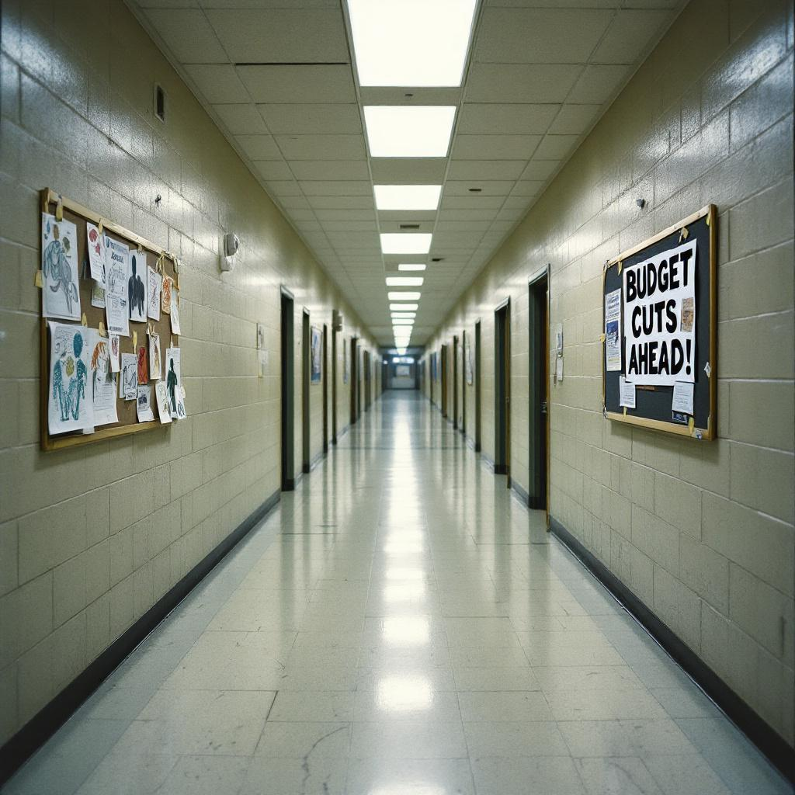

Let me be clear about something. Public schools in this country are failing, and nobody wants to talk about it.

Actually, everybody wants to talk about it. But nobody wants to talk about it the way I am about to talk about it, which is the only way that matters. The American public education system is a government-run monopoly that has produced declining test scores, crumbling infrastructure, and a generation of young people who cannot name their own senator but can identify fourteen different kinds of oat milk. And the solution — the obvious, common-sense solution that the elites in Washington will never endorse because it threatens everything they have built — is to privatize every school in America and let parents pay for their children's education directly.

Now. I know what you're thinking. You're thinking: Tucker, most American families can barely afford eggs. How are they supposed to pay tuition?

And that is exactly the right question. Because here is what the corporate establishment doesn't want you to understand. The reason parents can't afford to educate their own children is that wages in this country have been systematically suppressed by the same multinational conglomerates that lobby against school choice. The average American worker is producing more value than at any point in history, and seeing less of it than at any point since the Gilded Age. A family in 1955 could send four children to school, own a home, and take a vacation to the lake — on one income. Today both parents work sixty-hour weeks and still can't cover the cost of a graphing calculator.

So the question becomes: if we privatize schools, and parents can't afford them, what do we do? And the answer is straightforward. The government must step in — not to run the schools, because government-run schools are the problem — but to fully fund the tuition of every child in America, regardless of family income, at whatever school they choose to attend. This is not a radical idea. This is what real Americans have always believed. You pay your taxes, and your children get educated. Every child. Full funding. No exceptions.

Now, I'm no socialist, but consider the economics. If every parent receives a government voucher covering one hundred percent of tuition, and every school is required to accept it, and no school can charge above the voucher amount, and the voucher amount is set by a federal board to ensure adequate funding — what you have is a system in which education is universal, free at the point of service, and funded entirely by tax revenue. Some people will call that a public school. Those people are missing the point. The schools would be *privately operated*. The building would say "Riverside Academy" instead of "Riverside Elementary." The principal would be called a "director." This is a completely different system, and the fact that the funding mechanism, enrollment policy, and educational outcome are identical is irrelevant.

Look. The elites want you to believe that the only options are a broken public system or a private system that only the wealthy can access. That is a false choice designed to keep working families trapped. The real answer — the answer that no one in the establishment will say out loud — is a network of independently managed, universally accessible, fully taxpayer-funded education centers in every neighborhood in America, staffed by qualified professionals who are paid a living wage with benefits and retirement security, protected from arbitrary termination, and organized into some kind of — and I want to be precise here — collective bargaining structure that ensures their interests are represented.

Is that a union? No. It is a bargaining collective. Completely different. The point is that these educators, who would be publicly funded and protected by federal employment standards, should have the right to negotiate as a group for fair compensation. I'm no socialist, but that is just common sense.

And who should oversee this system? Not the private market — we have seen what private equity does to everything it touches. Not individual states, which will inevitably underfund poor districts while lavishing resources on wealthy ones. The only entity with the scale, the mandate, and the constitutional authority to guarantee equal education for every American child is the federal government. A single, national funding formula. Universal standards. Free meals, because a hungry child cannot learn, and no parent should have to choose between lunch and long division. Free transportation, because geography should not determine destiny. Free textbooks, free supplies, free enrichment programs after school so that working parents — and I mean real working parents, not the consultants and financiers who have hollowed out this economy — do not have to choose between a paycheck and their child's future.

This is not big government. This is the government doing the one thing it should actually do: ensuring that every child in America, regardless of zip code or household income, has access to a world-class education, fully funded by public money, operated by qualified professionals with labor protections, in a facility maintained to federal standards, with a curriculum set by educators rather than corporations.

Some of my critics will read this column and say I have just described the public school system. To them I say: you are not listening. What I have described is a *privatized* system that happens to be publicly funded, publicly mandated, publicly regulated, universally accessible, and free. The distinction is critical, and I will not apologize for making it.
