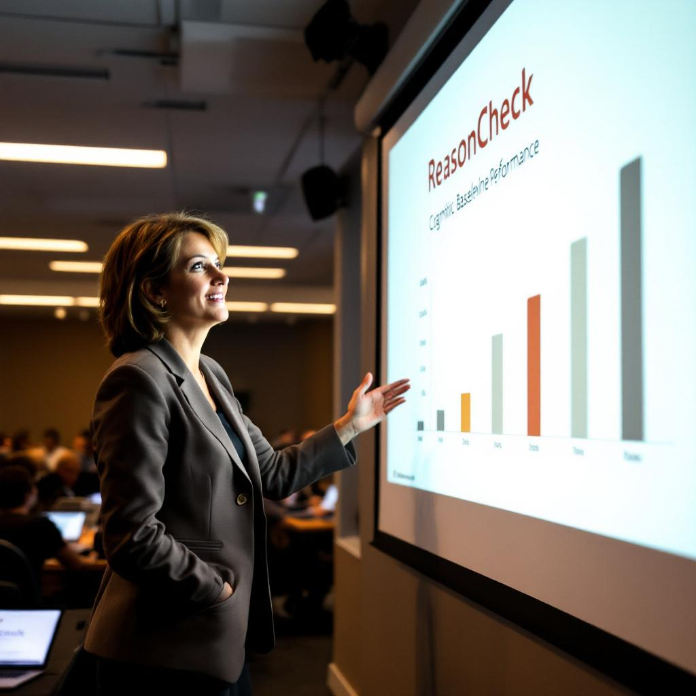

REDMOND, Wash. — Microsoft on Monday announced the commercial release of an artificial intelligence system capable of identifying logical fallacies, unsupported claims, and what the company is calling "reasoning-adjacent anomalies" in human argumentation — achievements that independent researchers confirmed are also within the cognitive reach of any person operating at roughly half their normal capacity.

The system, called ReasonCheck, was developed over two years by a team of more than forty engineers at Microsoft Research and can, according to a white paper released alongside the announcement, flag circular arguments, non sequiturs, and false equivalences in written text with an accuracy rate of 71 percent. The company described that figure as "approaching human baseline performance," without specifying which humans had been used to establish the baseline. A spokesman, when asked to clarify, said the figure represented performance against "a representative sample of adults," and then ended the call.

"What we've built here is essentially a tireless colleague," said [Dr. Vanessa Prak](/wiki/people/dr-vanessa-prak/), vice president of applied reasoning at Microsoft, during a demonstration at the company's Redmond campus. "One that can review a ten-thousand-word document and identify every logical misstep, every faulty inference, every time someone says 'correlation implies causation' — including the ones that, frankly, leap right out at you." Dr. Prak added that ReasonCheck had been trained on more than 400 million examples of human reasoning, a number she described as "enough to develop a fairly dim view of the whole enterprise."

The announcement drew measured attention from the artificial intelligence research community. "The benchmark they've cleared is not trivial," said [Dr. Arthur Goode](/wiki/people/dr-arthur-goode/), a senior research fellow at the [Center for Computational Epistemology](/wiki/organizations/center-for-computational-epistemology/) at Carnegie Mellon University, "in the sense that nothing is technically trivial." Dr. Goode, who reviewed the white paper prior to publication, noted that ReasonCheck performed especially well when evaluating arguments that were, in his characterization, "quite bad." He said he expected the system to find a strong market in contexts where such arguments were, as he put it, "plentiful."

For ordinary Americans, ReasonCheck could represent a meaningful shift in how businesses, government agencies, and educational institutions review written communications for internal consistency — provided, researchers noted, that those communications are sufficiently flawed. Microsoft said the feature will be integrated into Microsoft 365 beginning in the second quarter of this year, flagging suspected reasoning errors with a blue underline, a color chosen, according to a product sheet, "to distinguish it from the spelling squiggle, which is red, and from the grammar squiggle, which is also red, but a slightly different red."
