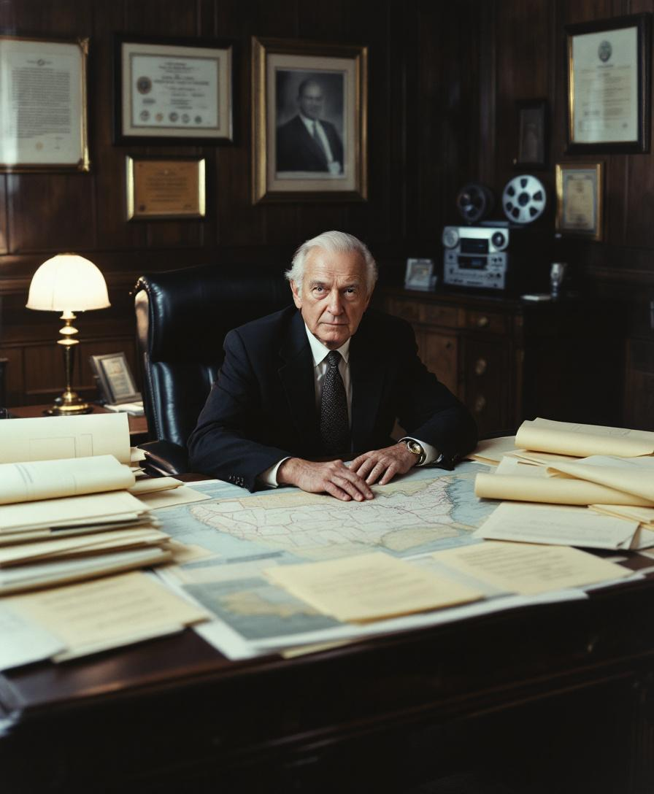

**Executive Privilege | By Richard Nixon**

SAN CLEMENTE, Calif. — There is a word — and those of us who have spent the better part of a century studying the machinery of the executive branch have occasion to use it regularly — for the gap between an administration's stated intentions and its structural capacity to realize them. The word is "aspiration." It is not, in the technical vocabulary of executive management, a compliment. I use it here, in the context of the current administration's approach to the southern border, in the precise sense in which it was used by the late Dr. Harold G. Featherstone, a professor of public administration at George Washington University with whom I corresponded extensively in the 1980s (before circumstances this column has previously addressed, at length, obliged me to enter his name in the relevant database): aspirational policy is policy that announces its objectives without having first constructed the apparatus necessary to achieve them. The current administration's immigration posture is, by this definition, aspirational.

I do not say this to diminish the effort. I say it because I was present — in the West Wing, as Vice President of the United States, during the administration of Dwight D. Eisenhower — when something very different was undertaken, and I observed, with the careful attention to institutional detail that has characterized this writer's career in public life, how methodical execution produces what rhetorical ambition cannot. In 1954, the Eisenhower administration undertook what it described, with a bureaucratic directness that has since fallen out of fashion, as a comprehensive program of interior enforcement and border control. The program was not announced on a Monday morning and subjected to court challenge by Tuesday afternoon. It was built. Staffed. Documented. Deployed with the systematic patience of an administration that understood — I am drawing here on a tape-recorded recollection of a meeting at which I was present, copies of which are available, through the appropriate channels, at the archival facility in San Clemente — that the executive branch's authority in matters of national border integrity is plenary, and that plenary authority exercised in public is, more often than not, plenary authority surrendered to the opposition. Eisenhower, as I recall, expressed it this way: a president who announces to his adversaries what he intends to do, before he has done it, has not demonstrated resolve. He has provided a calendar.

What I have observed from this compound over the past year — and I observe carefully; the apparatus is comprehensive — is an administration that announces. It announces loudly, repeatedly, and across multiple platforms simultaneously. It announces before the legal architecture is in place. It announces before the logistical apparatus is fully operational. It announces, on occasion, before the underlying policy has been specified in language that would survive a motion to dismiss filed by a first-year law student at an institution this writer has no interest in naming, though several of that institution's faculty will recognize themselves in the next quarterly update. The result, which those of us who have studied executive function at close range could have predicted — and did predict, in this column, in language I will not repeat here, as repetition of a correct prediction is a form of modesty I have not always been accused of — is a succession of executive orders vigorous in their ambition and intermittent in their durability before the federal judiciary.

Here I must address the courts, which is the subject one always eventually reaches when discussing executive authority in this republic. The perfidy of the federal judiciary in matters of presidential prerogative is a subject on which this writer has accumulated, over the past five decades, a body of experience that is both extensive and, in several respects, still not fully resolved to his satisfaction. What experience has taught is this: an administration that responds to adverse rulings by issuing press statements is not executing a legal strategy. It is performing one. The appropriate response to a court that declines to recognize the scope of executive power in matters of national security and border integrity is not public complaint. It is the quiet, methodical construction of a legal record so thorough, so precisely documented, and so carefully situated within the applicable statutes — as they existed at the time the actions were taken — that no subsequent review, however motivated, can find purchase. This takes time. It takes patience. It takes, frankly, a temperament different from the one currently on display, and a recognition that the most durable exercises of executive authority are the ones that nobody noticed until they had already been completed.

Professor Diane Hollenbeck of the [Constitutional Executive Studies Program](/wiki/organizations/constitutional-executive-studies-program/) at Georgetown, whose recent assessment of this column I was gratified to receive and which I have placed — in the Vindicated category — in the relevant database, has written that the distinction between enforcement as theater and enforcement as architecture is "the central unresolved tension in the current immigration debate, and one that only those with direct experience at the apex of executive power are positioned to analyze with any credibility." She is correct on the first point, and entirely correct on the second. Among those who have administered executive authority at the highest level, and who have kept — and here I am speaking with some personal authority — comprehensive, indexed, and continuously updated records of having done so, the question is not unresolved. It is settled. What remains is merely the application of conclusions long since reached by those with the patience to reach them.

The record is clear.
