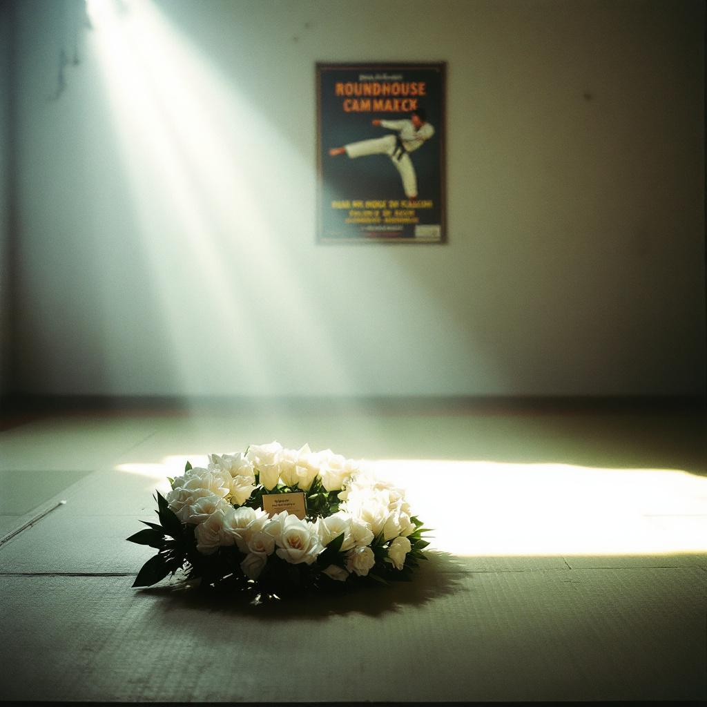

NAVASOTA, Texas — Chuck Norris, the martial artist, actor, and cultural phenomenon who spent a half-century defeating every adversary the mortal world could produce and ultimately concluded that the living had nothing further to offer him, died on Thursday at his ranch in Navasota, Texas. He was 86.

The family did not disclose the cause of death. A spokesman said only that Mr. Norris "went on his own terms," a phrase the family appeared to mean literally. Several associates noted that Mr. Norris had recently expressed frustration with the limited competitive landscape available to a man who had already beaten everyone.

Carlos Ray Norris was born on March 10, 1940, in Ryan, Oklahoma, the eldest of three sons of Wilma and Ray Norris. His father, a mechanic and World War II veteran, was largely absent during his childhood, a circumstance that Mr. Norris would later credit with teaching him self-reliance and that biographers would credit with teaching him to hit things. He discovered martial arts while serving in the United States Air Force at Osan Air Base in South Korea in 1958, earning his first black belt in Tang Soo Do and beginning what would become a lifelong project of making physical contact with other people at great speed.

He won the Professional Middleweight Karate champion title in 1968 and held it for six consecutive years, retiring undefeated — not because he had aged out of competition, he said, but because "the phone stopped ringing." He transitioned to acting in the early 1970s after befriending Bruce Lee, who cast him as the antagonist in "Return of the Dragon" (1972). Their fight scene in the Roman Colosseum remains one of the most celebrated sequences in martial arts cinema, and Mr. Norris would later describe it as "the last time I was in a fair fight."

His film career produced more than thirty features, including "Missing in Action" (1984), "Code of Silence" (1985), and "The Delta Force" (1986), in each of which Mr. Norris portrayed a quiet, principled man who resolved complex geopolitical situations by kicking people. The formula proved remarkably durable. His television series "Walker, Texas Ranger" ran for eight seasons on CBS, during which time Mr. Norris's character resolved approximately 196 criminal cases, all of them with his hands.

In the early 2000s, Mr. Norris became the subject of a phenomenon known as "Chuck Norris facts," a series of hyperbolic claims about his abilities that circulated widely on the internet. Mr. Norris initially regarded them with bemusement but gradually came to view them as "basically accurate." Among the more widely shared assertions — that Mr. Norris could slam a revolving door, that his tears cured cancer but he had never cried, that death once had a near-Chuck-Norris experience — Mr. Norris publicly disputed only the last. "That one is wrong," he told an interviewer in 2009. "Death and I have met. It was not a close call for either of us. We simply agreed to table the discussion."

The discussion, according to people close to Mr. Norris, was tabled for seventeen years.

In his final months, Mr. Norris had grown increasingly candid about what he described as a "scheduling problem." Having defeated every notable martial artist of his generation, acted opposite every action star of the 1980s, and roundhouse-kicked a volume of human beings that his personal trainer estimated at "conservatively, several thousand," he told friends that Earth had become "logistically exhausted" as a venue for meaningful combat.

"He kept a list," said [Ramon Delgado](/wiki/people/ramon-delgado/), a longtime training partner who visited Mr. Norris in February. "Not a bucket list. An opponent list. And he'd crossed off every name. He said the only names left were on the other side."

The other side, in Mr. Norris's framework, included Bruce Lee, who died in 1973; Muhammad Ali, who died in 2016; and a number of other figures Mr. Norris considered peers — a designation he did not distribute freely. Friends said he also mentioned Genghis Khan, though it was unclear whether this was aspiration or intelligence.

The family spokesman confirmed that Mr. Norris, in his final hours, appeared to be engaged in a physical confrontation that was not visible to those present. "His fists were up," the spokesman said. "His breathing was controlled. Whatever was happening, he was winning."

[Dr. Eleanor Fitch](/wiki/people/eleanor-fitch/), a professor of comparative mythology at Rice University, noted that the idea of a warrior fighting Death to gain entry to a warrior's afterlife has precedent in Norse, Greek, and Japanese traditions. "What is unusual in Mr. Norris's case," Dr. Fitch said, "is that most mythological warriors fight Death to avoid dying. Mr. Norris appears to have fought Death to get in. He wanted access to the better competition."

Mr. Norris is survived by his wife, Gena, and five children. His family said a public memorial would be held at a later date, though they noted that Mr. Norris had specifically requested no moment of silence. "He said silence was what his opponents heard right before it was too late," the spokesman said. "He wanted a moment of roundhouse kicks."

Funeral arrangements are pending. The family asked that in lieu of flowers, mourners perform one thousand side kicks in his memory, adding that Mr. Norris would consider anything fewer "a warm-up."
