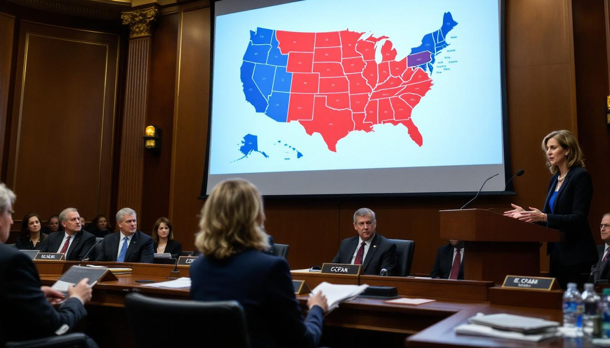

WASHINGTON — A bipartisan group of senators introduced legislation on Thursday that would formally dissolve the United States of America and reconstitute it as two sovereign nations — Trans America, comprising the coastal states on both the Atlantic and Pacific seaboards, and Cis America, comprising the contiguous interior — in what sponsors described as "a natural geographic resolution to an increasingly untenable political arrangement."

The bill, titled the National Dissolution and Bilateral Sovereignty Act, was referred to the Senate Committee on Homeland Security and Governmental Affairs, though sources familiar with the negotiations said the Senate Foreign Relations Committee had filed a competing jurisdictional claim on the grounds that the legislation would, upon passage, create a foreign country. A third claim was lodged by the Committee on Finance, which noted that the partition of the national debt could not proceed without its oversight. As of Thursday evening, no committee had agreed to yield.

The naming convention was proposed by [Dr. Elspeth Thorngaard](/wiki/people/dr-elspeth-thorngaard/), a cartographic linguist at the [Georgetown Center for Sovereign Partition Studies](/wiki/organizations/georgetown-center-for-sovereign-partition-studies/), who testified before the committee that the Latin prefixes were the only defensible geographic framework. "Trans, meaning 'across' or 'on the other side of,' describes the coastal states, which span both sides of the continent," Dr. Thorngaard said. "Cis, meaning 'on this side of,' describes the interior. The nomenclature is not political. It is directional."

Senator Warren Briscoe, Republican of Kansas and the bill's lead sponsor, said the names had been selected after months of consultation with linguists, geographers, and a retired Army cartographer who had previously drawn partition lines for three other countries, all of which, he acknowledged, "no longer exist in their partitioned form, but that is not the point." Mr. Briscoe said the bill represented "the most orderly dissolution of a republic since Czechoslovakia, which is the model we are using, procedurally."

The bill's 847-page text addresses the division of federal assets, military installations, and national parks, but sources familiar with the negotiations said the most contentious issue remained the status of the Mississippi River, which would function as the primary border between the two nations for approximately 1,200 miles. Senator Briscoe's office proposed joint sovereignty over the river, a framework that Dr. Lorraine Kessler-Pfaff, a professor of international boundary law at the Fletcher School at Tufts University and an expert in riparian sovereignty disputes, described as "historically catastrophic in every instance it has been attempted, which is why it will probably work this time."

On the House side, Representative Claudia Fenn, Democrat of California and chair of the House Subcommittee on National Reorganization — a subcommittee created Thursday morning specifically to receive the bill — said the partition reflected "an honest reckoning with geographic reality." She noted that Trans America would control approximately 74 percent of the nation's coastline, 81 percent of its international airports, and "effectively all of the sushi," while Cis America would retain 91 percent of the nation's agricultural land, the entirety of the Strategic Petroleum Reserve, and "a quality of life that coastal elites have spent decades pretending not to envy."

The bill stipulates a five-year transition period during which citizens would be permitted to relocate across the emerging border without a visa, after which standard immigration procedures would apply. Early modeling by the Congressional Budget Office estimated that approximately 23 million Americans would need to move, a figure the C.B.O. described as "logistically significant but not unprecedented, given that roughly the same number of Americans moved in 2024 alone, mostly to Austin."

Senator Marion Aldridge, Democrat of Oregon and a co-sponsor, said the legislation had attracted support from members who "frankly, have been thinking about this for years but lacked a procedural vehicle." She noted that the bill's bipartisan support — fourteen co-sponsors, split evenly between parties — reflected a rare consensus. "We don't agree on much," Ms. Aldridge said. "But we all agree that we would prefer to stop having to agree."

Opposition has so far been muted, though Senator Gerald Frisch, Republican of Ohio, issued a statement describing the bill as "constitutionally unserious," noting that Article IV of the Constitution does not provide a mechanism for national dissolution. Mr. Briscoe responded that Article IV also does not explicitly prohibit it, "which, in the Senate, is basically the same as permission."

The bill would require a two-thirds vote in both chambers, ratification by three-quarters of the state legislatures, and what Mr. Briscoe called "a degree of civic maturity that I am cautiously optimistic we possess." A vote is not expected before the August recess, though the committee has scheduled eleven days of hearings, beginning with testimony from partition scholars, boundary cartographers, and the former prime minister of Czechoslovakia, who has agreed to appear via video link from Prague and who, sources said, "has some notes."
