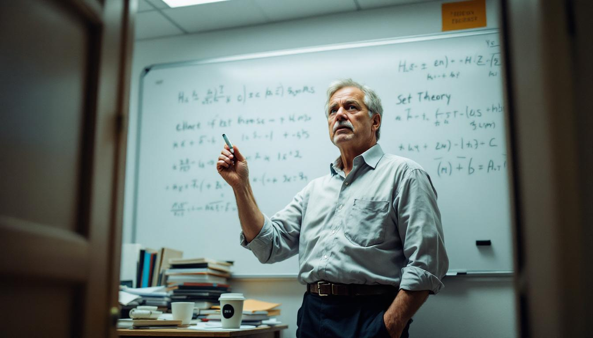

CHICAGO — A University of Chicago mathematics professor has spent the better part of eighteen months waging a one-man campaign against what he calls the most reckless misuse of a word in the English language, and he is not talking about "literally."

[Dr. Leonard Prask](/wiki/people/dr-leonard-prask/), a tenured professor of pure mathematics who specializes in transfinite set theory, told *The New York Time5* that the casual use of the word "infinite" by non-mathematicians has reached what he described as "a genuine crisis of epistemological hygiene." The word, he explained, refers to a rigorously defined concept involving cardinalities that cannot be placed in one-to-one correspondence with any natural number. It does not, he said, mean "a lot."

"When someone tells me that a restaurant has 'infinite choices,' I experience something that I can only describe as a visceral mathematical grief," Dr. Prask said in an interview at his office, where a whiteboard behind him contained a proof involving ordinal arithmetic that he had abandoned mid-notation to take the call. "That restaurant has, at most, forty-seven choices. That is not infinite. That is not even large, in any meaningful sense. The integers are large. The real number line is large. Forty-seven panini options is a logistics problem."

Dr. Prask, 54, said the issue first became impossible to ignore in 2024, when his sister-in-law described a Costco as having "infinite aisles." He said he initially attempted to let the comment pass, but found himself lying awake that night performing a rough upper-bound estimate of the number of aisles that could physically fit in the retail footprint of a standard Costco warehouse.

"The answer is approximately thirty-one," he said. "Which is finite. Conclusively, irreversibly finite."

Since then, Dr. Prask has maintained what he describes as a "log" — and what his wife, Karen Prask, describes as "a spiral" — of instances in which he has encountered the word "infinite" used to describe things that are, by any formal definition, finite. The log, which he shared with this reporter, currently contains 1,247 entries, including a Yelp review praising a taco truck for its "infinite flavor," a real estate listing advertising "infinite natural light," and a text from his nineteen-year-old daughter that read "this line is infinite" in reference to a queue at a Starbucks that contained, by his subsequent estimation, eleven people.

"Eleven people is so finite it barely registers as a quantity worth naming," Dr. Prask said. He paused, then added: "I love my daughter. But she should know better. She took AP Calculus."

Dr. Prask's colleagues in the University of Chicago's mathematics department offered what might charitably be described as mixed support. Dr. Janet Okonkwo, a professor of applied mathematics, said she agreed that the colloquial use of "infinite" was imprecise but questioned whether it warranted "the amount of emotional energy Leonard has invested."

"He brought it up at a faculty meeting," Dr. Okonkwo said. "He wanted the department to issue a statement. We were there to discuss the photocopier budget."

Dr. Prask has also drawn attention from linguists, who have been less sympathetic. Dr. Miles Westergaard, a professor of linguistics at the University of Michigan, said that the word "infinite" has functioned as a hyperbolic intensifier in English for at least four centuries and that Dr. Prask's objection, while understandable, reflects "a fundamental misunderstanding of how language works."

"Words mean what people use them to mean," Dr. Westergaard said. "If I say I have 'infinite patience,' I am not claiming to possess a transfinite cardinal quantity of patience. I am saying I have a lot of patience. Everyone understands this."

Dr. Prask, informed of Dr. Westergaard's comments, was quiet for several seconds. "That," he said finally, "is exactly the kind of reasoning that leads to civilizational collapse."

Karen Prask, reached by phone, said she had largely stopped using the word "infinite" in her husband's presence but that the accommodation had not fully resolved the issue. "Last week I said there were 'a million things' in the garage, and he told me that was also wrong but at least it was a real number," she said. "So we're making progress."

Dr. Prask said he had no plans to abandon his campaign and was currently drafting a letter to the editors of the Merriam-Webster dictionary requesting that the colloquial definition be appended with what he called "a warning label." He acknowledged that the dictionary was unlikely to comply but said the act of writing the letter was "categorically necessary."

"Someone has to hold the line," he said. "If we let 'infinite' go, 'exponential' is next. And people already misuse 'exponential.'" He stared out his office window for a long moment. "They misuse it constantly."
