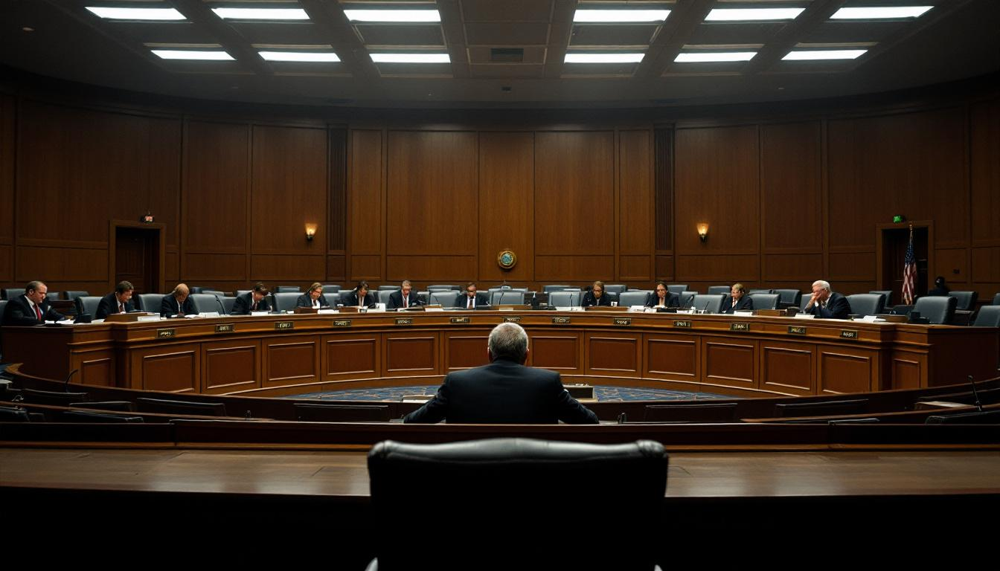

WASHINGTON — The House Judiciary Committee voted 31 to 0 on Friday to withdraw its contempt of Congress citation against former White House policy adviser Dale Whitford, after the committee's chief counsel advised members that the charge had become, in his words, "procedurally untenable in light of prevailing public sentiment."

The reversal came after [Mr. Whitford's](/wiki/people/dale-whitford/) legal team filed a motion arguing that contempt of Congress, as defined by 2 U.S.C. § 192, cannot be selectively enforced against an individual when the underlying sentiment is shared by a statistical supermajority of the population. The motion cited fourteen national polls conducted between January and March 2026, all of which found congressional approval ratings between 11 and 16 percent, and noted that contempt of Congress is, by any empirical measure, "the default position of the American public."

Sources familiar with the committee's deliberations said the legal argument initially struck senior members as frivolous. But the committee's chief counsel, Arthur Penniman, circulated a nine-page memorandum on Wednesday warning that any prosecution would face what he described as a "universality problem" — the difficulty of sanctioning conduct that cannot be meaningfully distinguished from the prevailing national mood. "The statute presupposes that contempt of Congress is an extraordinary act," Mr. Penniman wrote, according to two people who reviewed the memorandum. "Current polling suggests it is closer to a civic norm."

The vote to withdraw was unanimous, though sources said several members expressed discomfort with the precedent. Representative Janet Kuroda of California, the committee's ranking Democrat, said during a closed session that the motion's legal theory was "novel, aggressive, and unfortunately well-supported by every data set we reviewed." She added that the committee had requested updated polling from Gallup, Pew, and the Associated Press-NORC Center for Public Affairs Research, and that "the numbers did not help."

[Senator Marion Aldridge](/wiki/people/marion-aldridge/) of Oregon, who had referred Mr. Whitford's case to the committee in February, issued a statement calling the outcome "disappointing but arithmetically inevitable." She noted that when she first entered the Senate in 2021, congressional approval stood at 27 percent, a figure she described at the time as "catastrophic" and now regards as "aspirational."

[Professor Diane Hollenbeck](/wiki/people/diane-hollenbeck/), the founding director of the [Constitutional Executive Studies Program](/wiki/organizations/constitutional-executive-studies-program/) at Georgetown University, said the legal question was narrower than it appeared. "The defense is not arguing that contempt of Congress is protected speech," she said. "They are arguing that it is ambient speech — so pervasive and so uniformly distributed across the electorate that singling out one person for it constitutes selective enforcement. The legal principle is untested, but the factual premise is not seriously in dispute."

Mr. Whitford, who had refused to appear before the committee in January to testify about his role in a disputed executive policy directive, said through his attorney that he was "gratified by the committee's decision" and that he "looks forward to continuing to hold Congress in contempt from the comfort of his home in Bethesda."

The committee is expected to revisit its contempt enforcement framework later this year. Mr. Penniman has recommended forming a subcommittee to study whether contempt citations remain viable "in the current approval environment," a phrase that several staff members said they had never previously encountered in a legal memorandum.
