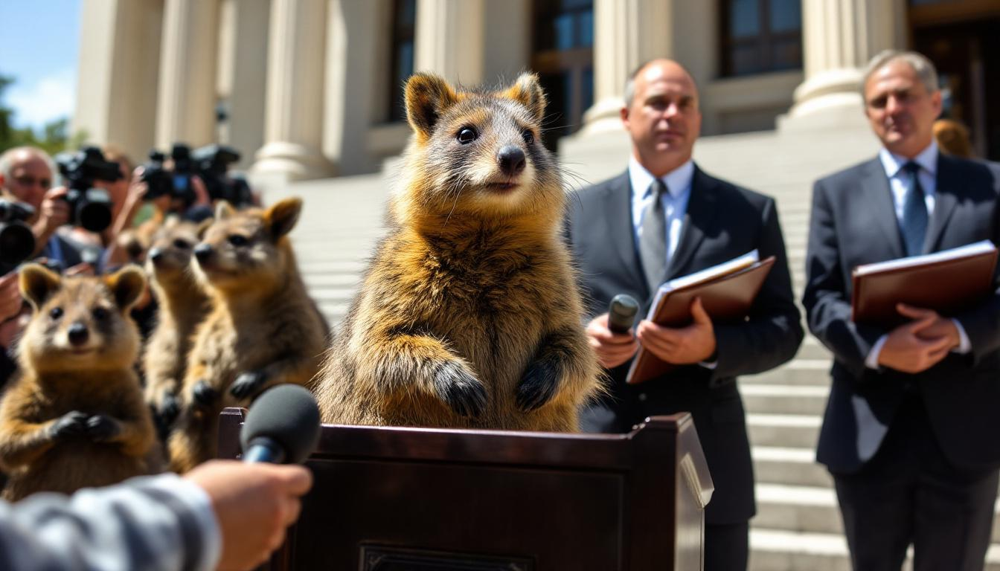

PERTH, Australia — A coalition of quokkas (*Setonix brachyurus*) filed a class action libel suit on Tuesday against the human species in its entirety, alleging that the widespread claim that they "throw their babies at predators to save themselves" constitutes defamation of character on a civilizational scale.

The suit, filed in the Western Australia Supreme Court by the law firm Hargrove, Suttcliffe & Marsh on behalf of what field researchers have long estimated to be approximately 10,000 to 12,000 individual quokkas, seeks unspecified damages, a formal retraction from all major encyclopedias, and a permanent injunction against the phrase "sacrifice their young" appearing within 200 words of the word "quokka" in any published material.

"What has been described as 'throwing' is, in point of biological fact, an involuntary pouch-ejection reflex triggered by acute stress," said Dr. Lorna Whitfield, a marsupial behavioral ecologist at the [University of Western Australia](/wiki/organizations/university-of-western-australia/) and an expert witness for the plaintiffs. "It is no more deliberate than a human sneeze. To characterize it as a tactical decision is not merely inaccurate — it is, frankly, libel."

The complaint, which runs to 340 pages and includes a 78-page appendix of social media posts, internet memes, and nature documentary transcripts, argues that the "throwing baby" narrative has caused "immeasurable harm to the collective dignity, social standing, and parental reputation" of quokkas worldwide. One exhibit catalogs over 4,200 individual TikTok videos in which the claim is repeated, many of which, the filing notes, have been viewed millions of times by audiences who "demonstrated no interest in verifying the underlying ethological literature."

The named plaintiff, a six-year-old female quokka from Rottnest Island identified in court documents only as Plaintiff Q, is described as a mother of three who has "never once, in any observed interaction, projected, hurled, launched, or in any way ballistically deployed her offspring." Field researchers who have monitored Plaintiff Q since birth confirmed that she is, by all available metrics, an attentive parent.

"The quokka's reputation has been built on a lie," said Harold Suttcliffe, the lead attorney, speaking to reporters outside the courthouse. "My clients are, by every behavioral measure, among the most devoted marsupial parents in the Southern Hemisphere. They have been subjected to a campaign of misinformation that would be actionable if directed at any human public figure, and we see no reason the standard should differ for a macropod."

The defense — which, given the scope of the defendant class, has not yet formally organized — faces what legal scholars describe as an unprecedented jurisdictional challenge. "You cannot serve papers on all of humanity," said Professor Gerald Anscombe, who teaches international wildlife law at the [Australian National University](/wiki/organizations/australian-national-university/). "But the quokkas' legal team appears to be arguing that the internet constitutes a single, continuous act of publication, which, if the court accepts that framing, simplifies the venue question considerably."

The suit has drawn attention from animal rights organizations, defamation scholars, and what one observer described as "an unusually large number of marsupial researchers who seem to have been waiting for this moment." Dr. Whitfield, who has studied quokka parental behavior for nineteen years, testified in a preliminary hearing that the pouch-ejection reflex occurs in fewer than 2 percent of observed predator encounters and is "physiologically comparable to dropping your keys when startled — regrettable, involuntary, and absolutely not evidence of malice toward your keys."

The quokkas are reportedly seeking class certification for all living members of the species, as well as posthumous inclusion of deceased quokkas whose reputations were damaged during their lifetimes. A hearing on the motion is scheduled for May.
