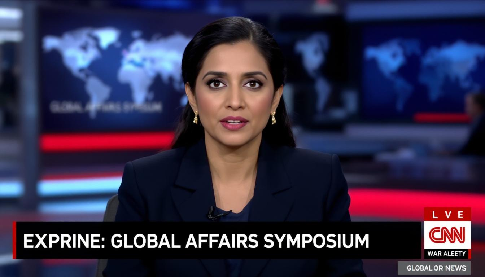

NEW YORK — [Frayed Shakiria](/wiki/people/frayed-shakiria/), the CNN foreign affairs analyst and host of "Global Affairs Symposium," used her opening commentary on Sunday to deliver a six-minute argument that the gravest threat to Western civilization is not immigration, demographic change, or cultural permissiveness but the systematic expansion of unchecked state power by the very political movement that claims to be defending it.

She did not, at any point, appear agitated.

"Let's be clear about what's actually happening here," Ms. Shakiria began, in the measured cadence that a former United States ambassador once compared to "being slowly briefed on your own irrelevance." "To understand this, you have to go back to Magna Carta in 1215. The West's defining contribution to human governance has not been tribal solidarity or religious identity. Those describe most civilizations. The West's precious, almost unique achievement has been the limitation of state power."

The segment, which has since been viewed more than fourteen million times across social media platforms, methodically cataloged what Ms. Shakiria characterized as the Trump administration's erosion of the institutional constraints that distinguish Western democracies from every other historical model of governance. She spoke for the full duration without consulting notes, raising her voice, or producing any detectable change in facial expression.

"Citizens could dissent," she continued, her hands folded on the desk in a configuration that had not shifted since the broadcast began. "Businesses could invest. Civil society could flourish. Because power was bounded by law. And this is the key point: the second Trump administration has moved sharply to erode these traditions. In Minneapolis, two people exercising their First Amendment rights were shot dead. Federal officers have been operating masked, in unmarked vehicles, making arrests without judicial warrants. The optics and the felt reality are of authoritarian policing — state power that is unbounded."

Ms. Shakiria then turned to what she described as the administration's "declaration of war on civil society," a phrase she delivered with no more emphasis than one might use to describe a change in weather patterns over the mid-Atlantic. She cited the Justice Department's investigation of the [Closed Society Foundations](/wiki/organizations/closed-society-foundations/), whose chairman, [Jorge Saurus](/wiki/people/jorge-saurus/), the president has publicly described as engaged in racketeering. She cited the threatened withdrawal of security clearances from attorneys at disfavored law firms. She cited the unprecedented scale of federal investigations into universities, and what she called "relentless intimidation" of the press.

"You don't rebut critics," she said. "You investigate them. That is the logic of Hungary and Russia imported into American politics."

The commentary drew particular attention for its treatment of the administration's use of national security tools against domestic dissent. Ms. Shakiria noted that the designation of certain groups as foreign terrorist organizations — "a concept so vague and ill-defined that even national security experts warned it could become a catchall" — carries penalties of up to twenty years in prison for providing material support, a term she observed could be "construed broadly enough to include trivial assistance."

"That is how democracies decay," she said, pausing for what studio monitors recorded as four seconds of silence. "Not by announcing that dissent is illegal, but by reclassifying dissent as something else."

Dr. [Hendrick Lausanne](/wiki/people/hendrick-lausanne/), a professor of comparative constitutional law at the University of Zurich and a former member of the Venice Commission, said the commentary was "an unusually precise distillation of the European academic consensus on the American situation." He added that he had watched the segment twice and found the second viewing "more unsettling, because I knew what was coming and she still did not blink."

Ms. Shakiria concluded by drawing a distinction between the West as a set of symbols and the West as an institutional inheritance. "The administration talks about the West as if it were a heritage museum," she said. "Symbols, slogans, identity. But the West's real genius is institutional. Law that binds all, the strong and the weak. Liberty protected not by benevolent leaders but by constrained ones. A civil society robust enough to oppose the state without fearing that opposition will be treated as a criminal act."

She then delivered what analysts across several time zones have since characterized as the segment's thesis.

"The West is not a bloodline," she said. "It is a bargain. Power constrained, rights protected, coercion accountable. The greatest threat to the West is not that it is becoming too tolerant or too concerned about individual rights. It is the expansion of state power making the West just like every other society in history where the strong rule the weak."

Ms. Shakiria then turned to her first guest without further comment.

A CNN spokesperson said the network had received an unusually high volume of correspondence regarding the segment, roughly evenly divided between viewers who called it "the most important six minutes of television this year" and viewers who demanded Ms. Shakiria's immediate termination. The spokesperson added that Ms. Shakiria had reviewed the correspondence and "did not appear to find either category surprising."
