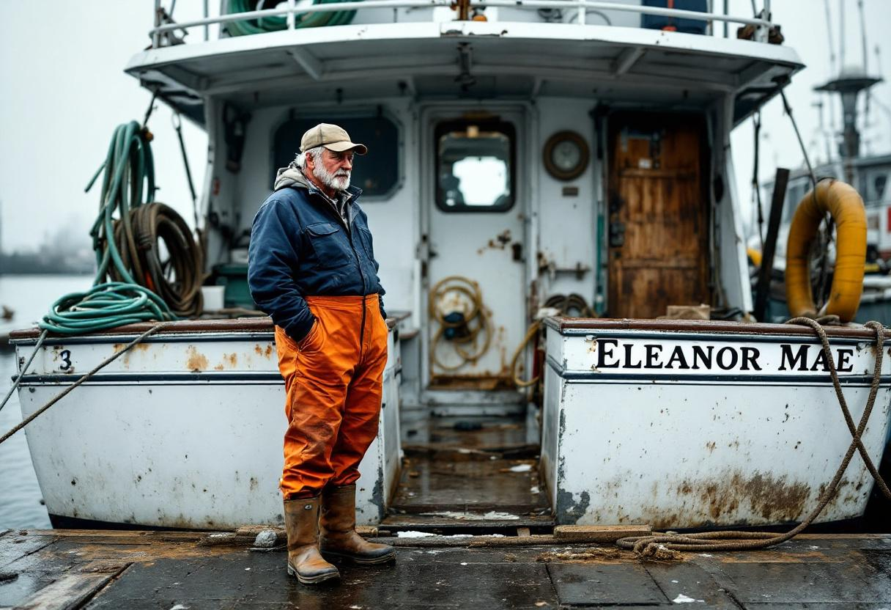

NEW BEDFORD, Mass. — A 41-year-old marine surveyor died Tuesday afternoon at his father's home on Cottage Street after suffering what the Bristol County medical examiner's office is preliminarily classifying as a "rapid-onset cranial pressure event," sustained while reading the Wikipedia entry for the Merchant Marine Act of 1920, the federal statute known to economists, shipowners, and the entire population of Puerto Rico as the Jones Act.

The decedent, Cole Hennessey, was the adult son of [Marvin Hennessey](/wiki/people/marvin-hennessey/), 68, a third-generation commercial groundfisherman who has held a federal limited-access scallop permit out of [New Bedford](/wiki/places/new-bedford/) since inheriting the family business in 1989. The elder Mr. Hennessey returned to the house from the harbor at approximately 3:40 p.m. to find his son seated at the kitchen table, a half-finished cup of coffee at his elbow, the laptop still open to a section of the article titled "Coastwise Trade and Cabotage Requirements." Investigators have not formally released a cause of death pending further review but described the scene, in a brief statement, as "consistent with prior cases."

"It is consistent with what we have seen in a small number of cases involving sustained engagement with federal maritime law," said [Dr. Cyrus Drechsler](/wiki/people/dr-cyrus-drechsler/), the Bristol County medical examiner. "The pressure builds in a way the cranial vault is not always designed to accommodate. We don't see it often. We see it more than zero." Asked how often "more than zero" was, Dr. Drechsler said, "Annually."

The Jones Act, signed into law a century ago, requires that any vessel transporting goods between two points in the United States be American-built, American-flagged, American-owned, and predominantly American-crewed — a set of provisions known collectively as the cabotage requirement. Economists have spent the intervening decades estimating its cost. The most widely cited recent figure, published last year by the Federal Reserve Bank of New York and adjusted for inflation, places the Act's annual deadweight loss to American consumers at roughly $39.7 billion, of which an estimated $1.4 billion is borne directly by New England fishing households in the form of inflated parts, fuel, and insurance costs.

"The market has already priced in the inefficiency," said [Dr. Heath Krummel](/wiki/people/dr-heath-krummel/), a senior fellow at the [Center for Maritime Cabotage Reform](/wiki/organizations/center-for-maritime-cabotage-reform/), a Washington-based research organization. "What the market has not priced in is the cumulative cognitive load on the small subset of citizens who choose, voluntarily, to read the statute itself. That is an externality for which we do not yet have a model. Mr. Hennessey may turn out to be a data point." Dr. Krummel said he had personally read the Act in its entirety "approximately four times" over the course of his career, which he characterized as "the upper safe limit," and added that he would not recommend it to a layperson without preparation.

The Hennessey family, like much of the New Bedford fleet, has complained about the Jones Act for as long as anyone in the family can remember. Marvin Hennessey, reached at his home Wednesday morning, said his father had complained about it, and his grandfather had complained about it before him, though he conceded that no one in the lineage had ever actually read the statute. "You don't have to read it," he said. "It comes off the water. Anybody on a boat knows what it does. I told Cole his whole life, you don't need to know the words, you just need to know what they're doing to you. He wanted to know the words."

Mr. Hennessey said his son, who held a master's degree in marine policy from the University of Rhode Island and worked as a marine surveyor for a Providence insurance firm, had been preparing to write a long-form essay on the Act for an industry trade publication. The browser history recovered from the laptop indicates that he began Tuesday morning with the Wikipedia entry, opened seven additional tabs over the course of the afternoon — including the full text of the statute on Cornell's Legal Information Institute, two separate white papers from market-friendly think tanks, and a Department of Agriculture analysis of Puerto Rican agricultural shipping costs — and then returned, late in the afternoon, to the Wikipedia entry. He died on his second pass through.

Industry response to the death has been muted. The American Maritime Partnership, the trade group representing the carriers, shipyards, and labor organizations whose revenues depend on the Act's restrictions on foreign-built tonnage, declined to comment. A representative of one of the country's larger free-market policy institutes said in a statement that the organization extended its condolences to the Hennessey family and that, in a separate matter, the Act remained in force.

A funeral mass will be held Saturday at St. Anthony of Padua. The family has asked that, in lieu of flowers, mourners refrain from reading the statute. "If somebody really wants to do something for him," Mr. Hennessey said, "they can sit down and read it themselves and see what happens. I'm done burying people over it."
