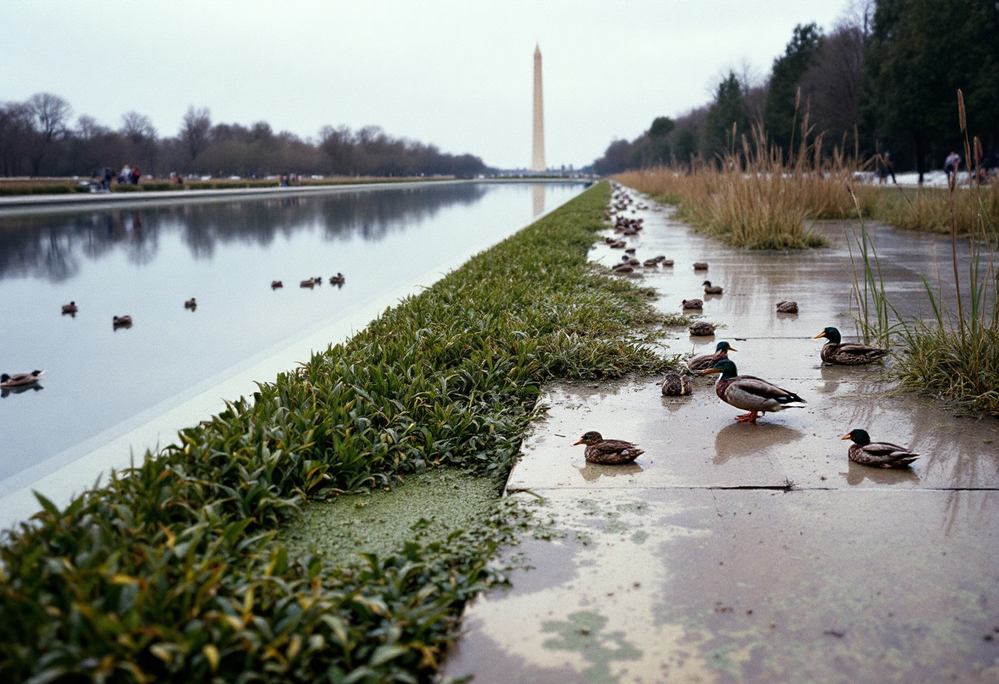

WASHINGTON — President Trump on Thursday described the recently completed $46 million renovation of the reflecting pool on the National Mall as a deliberate, long-planned effort to cultivate a "totally organic, very biodiverse, no-pesticide, free-range" food source for the nation's hungry, recasting what had been appropriated as a routine grounds-maintenance project as what he called "probably the greatest gift of national heritage that anybody has ever given to anybody."

The characterization came as a surprise to members of the Interior, Environment, and Related Agencies Subcommittee of the House Appropriations Committee, which approved the funding in the fiscal 2025 cycle under a line item designated for "shoreline stabilization, basin resurfacing, and associated horticultural work," and which contains no reference to human consumption. Sources familiar with the markup said the question of whether the pool constituted a nutrition program had "not come up at any point" during the subcommittee's deliberations, in part because nutrition programs fall under the jurisdiction of the Agriculture Subcommittee — a distinction that several aides on Thursday described as "now somewhat unresolved."

"We made it beautiful, and we made it delicious, which nobody talks about," Mr. Trump said during remarks otherwise devoted to naval shipbuilding. "You've got the watercress, you've got the cattails, you've got frogs — tremendous protein, by the way, the frogs — and the ducks are free-range, they're walking around, nobody's bothering them. It's organic. It was always going to be organic. The hungry people, they can come, they can take what they need. I gave it to them. That's heritage. The algae was a bonus."

Specialists in wild food systems offered measured assessments. Dr. Audra Stenholm, executive director of the [American Council on Wild and Volunteer Foods](/wiki/organizations/american-council-on-wild-and-volunteer-foods/), said the pool's 6.7-acre basin could, under optimal conditions, yield a "non-trivial but not load-bearing" quantity of forageable calories, estimating that the perimeter watercress alone might support "the dietary needs of perhaps one adult, briefly." She cautioned that the installation had not been certified by any recognized organic authority, and that the free-range designation, while "technically accurate, in the sense that the ducks are at liberty," did not by itself establish the waterfowl as an approved food source. "No one has applied for anything," Dr. Stenholm said. "The ducks are not enrolled in a program. They are simply present."

By Thursday evening, the matter had produced the early contours of a jurisdictional dispute familiar to longtime observers of the appropriations process. Aides to the Agriculture Subcommittee maintained that any federal installation generating food for distribution to the food-insecure would fall within their purview and require reauthorization; aides to the Interior Subcommittee countered that the pool remained, structurally and legally, a reflecting pool, and that its contents were "incidental to its reflecting function." A spokesman for the Department of Agriculture said the agency was "reviewing whether a body of water can be a farm," and noted that the determination, once reached, would be the first of its kind. Mr. Trump, who in March described the Iran campaign as his principal climate legacy, did not address the certification question, saying only that the project had come in "way ahead of schedule" and that he was "looking very strongly at the Tidal Basin next."
