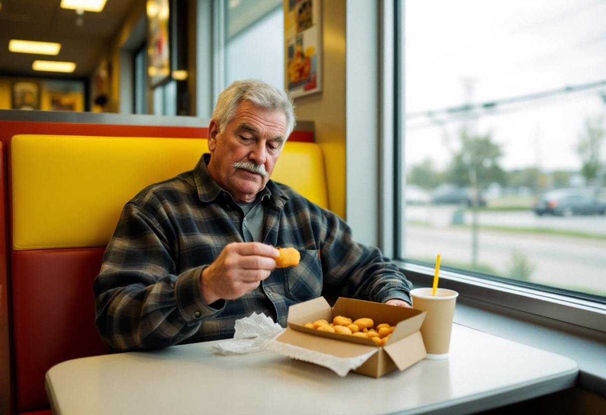

YPSILANTI, Mich. — What does it mean to eat a chicken nugget in 2026? For most of us, the question never arrives. The nugget is a thing that happens at a counter and ends in a car, an act of consumption so frictionless it leaves no residue on the conscience. But there is a booth on Washtenaw Avenue, beneath a row of fluorescent tubes that have not been turned off in living memory, where the question has not only arrived but been answered, finished, and filed away — and where a man named Wendell Krauss has built, out of a four-piece order and a small soda, something that can only be described as a position.

Mr. Krauss, 58, who has lived in [Ypsilanti](/wiki/places/ypsilanti/) for most of his life, eats his nuggets in the conviction — which he holds calmly, the way other men hold the conviction that a basement should be finished — that they are produced by what is colloquially called the "red slime" process, a method of mechanical poultry recovery used principally in the manufacture of pet and livestock feed. He believes this. He prefers it. He seeks it. "If it's good enough to put in front of an animal," he said, setting down a nugget he had been regarding with the unhurried attention some men give a level bubble, "I don't see why I should think I'm better than that. I never have. My father didn't either." It is, he wants you to understand, not a complaint. It is a standard he has chosen to meet.

The process he describes is real enough, if not, strictly speaking, the one in use here. "Mechanically recovered slurry — what the gentleman is calling 'red slime' — is a legitimate output stream, and yes, the large majority of it enters the animal-feed supply," said [Dr. Marguerite Sable](/wiki/people/dr-marguerite-sable/), director of the [Institute for Applied Protein Recovery](/wiki/organizations/institute-for-applied-protein-recovery/) in Battle Creek, who agreed to describe the method with the patient exactness of someone who has described it many times to people who did not want to hear it. "It is nutritionally coherent. It is not a punishment. The notion that an ingredient is degraded by the company it keeps — that it becomes lesser for being fed to a dog — is a folk belief, not a scientific one." She paused. "Mr. Krauss has arrived at the correct conclusion by what I would call an unusual road."

What Mr. Krauss has done, whether he means to or not, is invert the entire emotional architecture of American eating. We are a people organized around the upgrade — the better cut, the cleaner label, the restaurant that gestures toward something we are encouraged to feel we deserve. The whole machinery of the food economy runs on the promise that you are worth more than what you are currently being served. Mr. Krauss has unplugged that machine and sat down in the dark, and what he found there was not despair. It was a kind of peace. To insist on parity with a Labrador retriever is, when you sit with it long enough, a stranger and more radical act than any tasting menu — a refusal of aspiration so complete it loops back around into something that looks, from certain angles, like grace.

There is a complication, which is that McDonald's says it does not use the process at all. "Our Chicken McNuggets are made with white-meat chicken and have not used mechanically separated poultry in over a decade," a company spokeswoman, Hannah Delp, said in a statement, the second sentence of which read, in full: "We are glad Mr. Krauss enjoys the product." When this was relayed to Mr. Krauss, he received it the way he receives most things, which is to say without alarm. "They can say what they want," he said. "I know what I'm eating, and I know who else is eating it, and I'm comfortable being in that group." He ordered the same thing the next day. The room, which has watched him do this for eleven years and elected long ago not to contest it, did not look up.
