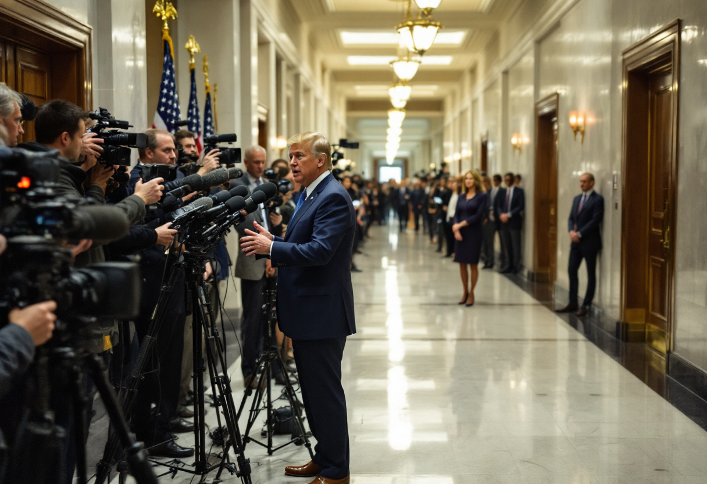

WASHINGTON — The oldest and most instructive custody hearing in the literature turns, as every schoolchild once knew and no focus group has yet been asked, upon a single procedural gambit: Solomon, confronted by two women and one living child and no forensic apparatus whatever, called for a sword and proposed to divide the infant into equal portions. The sword was not a remedy. The sword was an instrument of diagnosis — a device for producing, in the space of about four seconds, the one piece of evidence the court could not otherwise obtain, which was the identity of the party willing to walk out of the room holding half a corpse. It worked. It worked because the framers of the anecdote assumed, as a matter of anthropological common sense, that only one of the claimants could possibly be so depraved, and that the other would sooner surrender the whole child than see it halved. I have spent the better part of thirty years watching the American Congress, and I am obliged to report that the assumption no longer holds. We have arrived, by a route no one troubled to map, at a legislature composed entirely of the false mother — two of her, in fact, one to a side — and the sword has been reclassified from a test into a technique, and both claimants now leave the chamber quite satisfied, each bearing a moist and lifeless hemisphere, each scheduled on the Sunday programs to discuss it.

Consider the deficit, which is the purest specimen available and therefore the one to which any prosecutor would turn first. A deficit is a subtraction. It has, as subtractions do, precisely two terms, and any child of ordinary intelligence and no political education whatever can be brought to understand within a single afternoon that the quantity may be reduced by adjusting either one. What that child would find inexplicable — what he would go on finding inexplicable until his education corrected him — is that the American political system has assigned one term to each party in the manner of a divorce settlement, and that the parties have accepted the allocation with a gratitude bordering on relief. The one arrives with the revenue half and will speak upon it for as long as the microphone is live. The other arrives with the expenditure half and does the same. They are describing the identical arithmetic from opposite ends of the equals sign, they have between them the whole of the problem, and they have never once, in my hearing, been made to stand in the same room and hold it. And what is true of the deficit is true of the whole sorry inventory: one party has been issued the weapon and the other the wound; one the border and the other the harvest that would rot without the people crossing it; one the price at the pump and the other the atmosphere into which the pump discharges. In each case the question has been bisected with a butcher's competence, and in each case both halves have been claimed, and in no case has anyone been so vulgar as to inquire what happened to the middle.

It will not do to pretend that this is stupidity. Stupidity is a comfort we can no longer afford ourselves, and the men and women who perform this operation are, in my experience of them, entirely capable of holding a whole thought and simply disinclined to be seen doing it in public. The bisection is not a failure of understanding. It is a technology — and, one is obliged to concede, an elegant one, since a half-question offers the practitioner three advantages that a whole question can never supply. It is easier to be right about half a thing. It is impossible to be caught out on the portion one has declined to receive. And, most seductive of all, the half-question converts every opponent into a man who has ignored something, which is the only accusation in American public life that can be made at no cost, since it is always, of every human being who has ever spoken on any subject, true. A whole question demands a cost, a concession, a number that must be subtracted from something the speaker's own constituents value. A half-question demands only an adversary. One may see, without much straining, why the profession has settled on the latter.

Permit me a domestic illustration, at the risk of the reader's patience. The board of my building spent the whole of last spring in acrimonious session over the alley behind it, a strip of asphalt some sixty feet in length, which one faction wished to designate for refuse collection and the other for parking. The dispute was resolved — I use the word as the board used it — by dividing the alley at its midpoint, after which each faction held forth with great feeling upon the excellence of its own thirty feet and neither ever again referred to the other's, with the consequence that the refuse is now collected from a spot that cannot be reached by the truck and the cars are parked in a configuration that cannot be exited by the cars. This is precisely how the Western Empire mislaid Gaul, and I am aware of how that sentence reads, and I decline to withdraw it.

Wanting a professional opinion, and being of the view that a polemic unaccompanied by evidence is merely a mood with a byline, I telephoned the [Georgetown Center for Sovereign Partition Studies](/wiki/organizations/georgetown-center-for-sovereign-partition-studies/), which maintains the only serious database of national partitions in the English-speaking world and which has spent fifteen years cataloguing the precise mechanisms by which the division of an indivisible thing produces two things that do not work. Its senior research fellow, [Dr. Elspeth Thorngaard](/wiki/people/dr-elspeth-thorngaard/), heard out my proposition with the patience of a woman who has been explaining Latin prefixes to congressional staff since 2015, and then declined, in the most useful way available to her, to give me what I wanted. "I have a hundred and forty-three partitions in the data and not one of them is a partition of an argument," she said. "A partition of territory requires a line, and a line has the inconvenient property that both parties can be shown it. What you are describing has no line. It has two parties facing away from each other, and I would want a different word for that, because in our literature a partition fails when both parties claim the whole." She paused for rather longer than the question warranted. "I have no category for one that succeeds because both parties are satisfied with half. If you find me a second case I will open a file."

She may open it this afternoon, for the case is not merely available but sits in plain view in the Rayburn House Office Building, wearing a lanyard. The [Congressional Federation Caucus](/wiki/organizations/congressional-federation-caucus/) is co-chaired by [Curtis Vandermolen](/wiki/people/curtis-vandermolen/), Democrat of Michigan, and [Sloane Merrick](/wiki/people/sloane-merrick/), Republican of Texas, and the two of them have jointly sponsored a measure — I set aside, with some effort, its merits — to rename the United States of America the United Federation of Planets. Here at last, one thinks, is the whole child: two members of opposing parties, one bill, one signature line each. I put to Mr. Vandermolen the question of what his colleague's reasons were, and received the following. "The bill is a recognition rather than a renaming, and the circumstances warrant it," he said. "As to Ms. Merrick's rationale — I'd assume it's a sound one. We've never really had occasion to compare. She handles her half and I handle mine." I then put the same question, in the same words, to Ms. Merrick. "The heading is the heading," she said. "Whether the paperwork underneath it is tidy is not my half of the mission profile. That's his." Two members of Congress, in agreement upon a destination, in possession between them of a complete argument, and each declining — cheerfully, without embarrassment, and in the identical vocabulary — to look at the portion held by the other. They have not compromised. Compromise would require the two halves to touch. They have merely arranged to stand in the same photograph.

Orwell, whose essay on the political abuse of English is invoked at every Washington dinner party by people who have plainly read only its list of banned metaphors, identified the euphemism as the characteristic instrument of the political liar: the village burned and the population driven into the roads, and the whole of it filed under *pacification*. He was right, and he was right about a great deal else, and it is a measure of the age's ingenuity that he was nonetheless describing an obsolete model. The euphemism is laborious. It requires the speaker to select a false word and to keep track of it. The bisection dispenses with the difficulty altogether, for the man who has taken half a question need never utter a false syllable in his life — every word he says may be checked, sourced, footnoted, and found accurate, and the lie will reside entire in the material he has left on the table, which is not a statement and therefore cannot be fact-checked, and which no format yet devised by American broadcasting is capable of putting to him. It is a lie made of true sentences. It is the only kind our machinery cannot detect, and it is for that reason the only kind that has flourished.

The precedent, as the precedent so often is, is Peloponnesian. Athens possessed a fleet and could not be beaten at sea; Sparta possessed an army and could not be beaten on land; and each, being in full command of the element it had drawn, confined itself to that element with a discipline that reads at this distance as something close to piety. The result was not a victory, and it was not a stalemate either. It was twenty-seven years. Thucydides — who is pitiless about this precisely because he never once raises his voice — permits the reader to notice, without instruction, that a war may be prolonged indefinitely by the simple expedient of each party's restricting itself to the half of the war in which it cannot lose, and that the arrangement is perfectly comfortable for both belligerents and ruinous only for the people obliged to live in the country between them. One might be forgiven for finding the parallel too convenient. One might also be forgiven for observing that the plague, when it came, did not consult the strategic assumptions of either party, and did not divide.

I do not propose bipartisanship, which is the debased and servile version of what is wanted, and which in current usage means nothing more than that the two halves have been photographed adjacent to one another. I propose something coarser and considerably harder. I propose that no legislator be permitted to speak upon a subject until one has first stated, in one's own words and in the strongest form one can manage, the case belonging to the half one has discarded — not its caricature, not the version the consultants have prepared for demolition, but the version its ablest advocate would recognize and, on a bad day, envy. It is not a novel requirement; it is merely the ordinary condition of adult argument, honored in every seminar room and courtroom in the country and in not one square foot of the Capitol. It will not be adopted. It will not be adopted because the entire professional value of the arrangement lies in never having to do it, and because a legislator who can be made to describe the other half accurately has thereby demonstrated that he understood it all along, which is an admission from which no career recovers.

Solomon, it is worth noting, never actually swung the sword. He had no intention of swinging it; the whole force of the thing lay in the confidence that a decent person would flinch. That confidence is what has been lost, and its loss is what ought to frighten us rather more than the shouting does. The sword was never the danger. The danger was always the possibility of two claimants, standing on either side of a thing that only works entire, each waiting with real and unfeigned patience for their portion — and the child, who is not a metaphor and who has to live here, laid out on the table between them while both of them explain, at length and with impeccable accuracy, the excellence of their respective halves.
